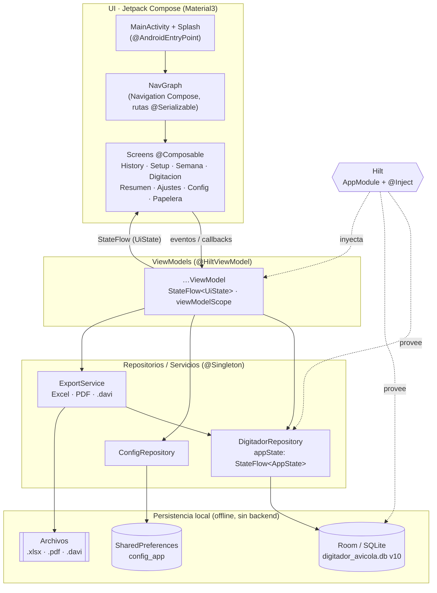
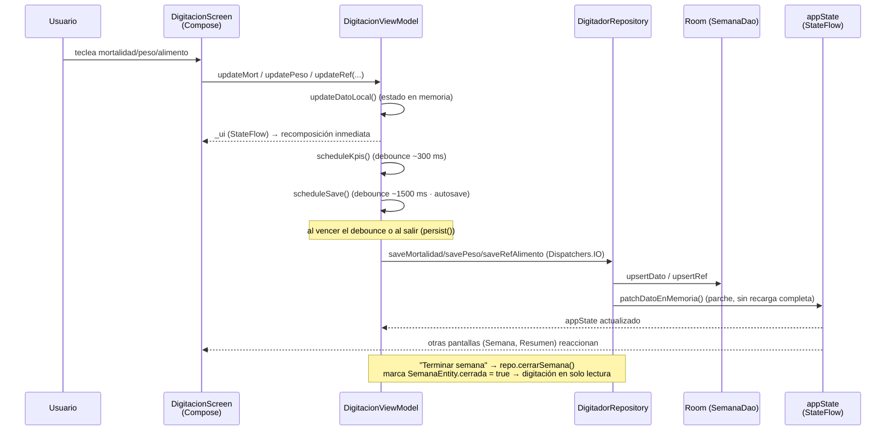

# Arquitectura — DigitadorAvicola / Flock Tracker

> Documento técnico de arquitectura. Refleja el estado **actual** del código
> (Room v10, PIN hasheado, `allowBackup=false`, autosave en digitación,
> transacciones atómicas). Las referencias citan rutas relativas al proyecto y,
> cuando ayuda, `archivo:línea`.

---

## 1. Visión general

**DigitadorAvicola** (marca comercial **Flock Tracker — "Smart Poultry Management"**)
es una app **Android nativa** para gestionar **ensayos de engorde de pollo broiler**.
El usuario digita semana a semana, por parcela (jaula), tres tipos de datos —
**mortalidad** (por día de la semana), **peso** (muestreo) y **alimento**
(ingreso/saldo por referencia BR1..BR4) — y la app calcula los indicadores del
ensayo (saldo de aves, FCR semanal/acumulado, GDP, mortalidad acumulada, CV del
peso, FEP, etc.) y los exporta a **Excel** (hoja "Estadística") y **PDF**.

Características que definen la arquitectura:

- **100% offline / sin backend.** No hay red, ni API, ni autenticación remota.
  Toda la persistencia es local: **Room (SQLite)** para los datos del ensayo y
  **SharedPreferences** para la configuración. No hay ninguna dependencia de
  networking en `app/build.gradle.kts`.
- **Sin respaldo automático del SO.** `android:allowBackup="false"`
  (`app/src/main/AndroidManifest.xml:6`) — los datos no se suben a la nube de
  Android; el "backup" es manual vía archivos `.davi` (export/import por intent).
- **Intercambio por archivos `.davi`.** Un lote completo o solo su distribución se
  comparte como archivo `.davi` (JSON) por WhatsApp/Archivos/Drive; la app lo
  recibe por `intent-filter` y lo importa.
- **Dominio del ensayo.** Jerarquía de datos: `Partida` (lote) → `Galera` →
  `Corral` (tratamiento) → `Parcela` (jaula/repetición), más `Semana` y los
  datos por parcela/semana.

---

## 2. Stack y versiones

Todas las versiones provienen de `gradle/libs.versions.toml` y la configuración de
módulo de `app/build.gradle.kts`.

### Identidad del módulo (`app/build.gradle.kts`)

| Propiedad        | Valor                       | Línea |
|------------------|-----------------------------|-------|
| `namespace`      | `com.digitador.avicola`     | :15   |
| `applicationId`  | `com.digitador.avicola`     | :19   |
| `compileSdk`     | 35                          | :16   |
| `minSdk`         | 26 (Android 8.0)            | :20   |
| `targetSdk`      | 35                          | :21   |
| `versionCode` / `versionName` | 1 / `1.0.0`    | :22-23 |
| Java/Kotlin JVM  | 17 (`VERSION_17`)           | :44-45 |

> El build de **debug** usa `applicationIdSuffix = ".debug"` (:30), por lo que el
> debug y el release pueden coexistir. El **release** activa `isMinifyEnabled` e
> `isShrinkResources` (R8/ProGuard, :34-35) y, por conveniencia, firma con la
> clave de debug (:39). `ksp { arg("room.schemaLocation", "$projectDir/schemas") }`
> (:10-12) exporta el esquema de Room a `/schemas` para soportar migraciones reales.

### Plugins y librerías (`gradle/libs.versions.toml`)

| Componente                         | Versión        |
|------------------------------------|----------------|
| **AGP** (Android Gradle Plugin)    | `9.2.1`        |
| **Kotlin**                         | `2.3.21`       |
| **KSP**                            | `2.3.7`        |
| **Compose BOM**                    | `2024.09.00`   |
| Compose UI / Material3 / icons     | (gestionado por el BOM) |
| **Room** (runtime/ktx/compiler)    | `2.8.4`        |
| **Hilt** (Dagger)                  | `2.59.2`       |
| **Hilt Navigation Compose**        | `1.2.0`        |
| **Navigation Compose**             | `2.9.8`        |
| **Coroutines** (`kotlinx-coroutines-android`) | `1.8.1` |
| **Gson**                           | `2.10.1`       |
| **Apache POI** (`poi-ooxml`, export Excel) | `5.2.5` |
| **DataStore** (`datastore-preferences`) | `1.1.1`   |
| **AndroidX Lifecycle**             | `2.10.0`       |
| **Activity Compose**               | `1.9.1`        |
| **Core KTX**                       | `1.13.1`       |
| **Core SplashScreen**              | `1.0.1` (declarada literal en `build.gradle.kts:73`) |

Notas:

- Se aplica además el plugin de **serialización de Kotlin**
  (`kotlin("plugin.serialization")`, `build.gradle.kts:6`), usado por las rutas
  de navegación tipadas (`@Serializable` en `Screen`).
- **DataStore** está declarada como dependencia, pero la configuración real
  (PIN, modo de digitación, preferencias por lote) hoy se persiste con
  **SharedPreferences** en `ConfigRepository`.
- POI obliga a excluir duplicados de `META-INF` en `packaging.resources`
  (`build.gradle.kts:55-65`).

---

## 3. Patrón de arquitectura: MVVM + StateFlow + Repositorios + Hilt

La app sigue **MVVM unidireccional**:

```
Compose UI  ──(eventos / callbacks)──▶  ViewModel  ──▶  Repository  ──▶  Room / SharedPreferences
    ▲                                       │
    └──────────  StateFlow  ◀───────────────┘
```

- **UI (Jetpack Compose, Material3).** Cada pantalla es `@Composable` y obtiene su
  ViewModel con `hiltViewModel()` (p. ej. `ui/screen/semana/SemanaScreen.kt:65`,
  `ui/screen/digitacion/DigitacionScreen.kt:62`). La UI observa el estado con
  `collectAsState()` sobre el `StateFlow` del ViewModel y reacciona; nunca toca
  Room directamente.
- **ViewModel.** Cada uno es `@HiltViewModel` con `@Inject constructor` que recibe
  los repositorios (`DigitadorRepository`, `ConfigRepository`, `ExportService`).
  Expone su estado como `StateFlow<…UiState>` inmutable (un `MutableStateFlow`
  privado `_ui` + `asStateFlow()`), y lanza trabajo en `viewModelScope`. Ejemplo:
  `DigitacionViewModel` (`ui/screen/digitacion/DigitacionViewModel.kt:46-53`).
- **Repository.** `DigitadorRepository` (singleton) es la **única puerta** a la
  base de datos: convierte entidades Room ↔ modelos de dominio, aplica
  transacciones y publica el estado del lote activo. `ConfigRepository` hace lo
  propio con las preferencias. `ExportService` orquesta export/import (Excel, PDF,
  `.davi`) apoyándose en el repositorio.
- **Room / SharedPreferences.** Capa de persistencia. Room con DAOs `suspend`;
  SharedPreferences para configuración.
- **Modelos de dominio** (`domain/Models.kt`) son `data class` `@Immutable`,
  independientes de Room — Compose puede saltarse recomposiciones de filas no
  modificadas.

### Recorrido de un dato: de la UI a Room y de vuelta

Ejemplo concreto: el usuario teclea la **mortalidad de un día** en la pantalla de
digitación.

1. **UI → ViewModel.** El campo de texto invoca
   `DigitacionViewModel.updateMort(...)`
   (`ui/screen/digitacion/DigitacionViewModel.kt:244`). El VM valida (no superar el
   saldo disponible de aves), actualiza el estado **en memoria** con
   `updateDatoLocal(...)` (:393) — emisión inmediata por el `StateFlow`, la UI
   recompone al instante — y programa dos tareas con _debounce_:
   `scheduleKpis()` (recalcula KPIs ~300 ms después, :205) y `scheduleSave()`
   (autosave ~1500 ms después, :352).
2. **ViewModel → Repository.** Al disparar el autosave (o al salir de la pantalla
   vía `persist()`, :340), `guardarSemanaActual()` (:363) llama a
   `repo.saveMortalidad(...)` / `savePeso` / `saveRefAlimento` / `saveConsAjust`
   por cada parcela/semana, en `Dispatchers.IO`.
3. **Repository → Room.** `DigitadorRepository.saveMortalidad(...)`
   (`data/repository/DigitadorRepository.kt:488`) lee el dato existente, hace
   `semanaDao.upsertDato(...)` y, en vez de recargar el lote entero, aplica un
   **parche en memoria** del estado global con `patchDatoEnMemoria(...)` (:554) —
   evita recargas costosas (OOM) en cada pulsación.
4. **Room → Repository → StateFlow.** El parche actualiza `_appState`
   (`MutableStateFlow<AppState>`, :27). Otras pantallas que observan
   `repo.appState` (p. ej. la de Semana) reciben el cambio.
5. **StateFlow → UI.** El ViewModel mapea ese estado a su `UiState`; Compose
   recompone solo lo necesario gracias a los modelos `@Immutable`.

> Variante "fría": si `_appState` aún no tiene partida, el repositorio hace una
> **carga completa** vía `cargarEstado(...)` (:34) que arma el `AppState`
> (partida + galeras + corrales + parcelas + semanas + datos + refs) desde los
> DAOs.

---

## 4. Estructura de paquetes

Raíz del paquete: `app/src/main/java/com/digitador/avicola/`.

```
com/digitador/avicola/
├── DigitadorApp.kt              @HiltAndroidApp — punto de entrada de Hilt (Application)
├── MainActivity.kt             Activity única (@AndroidEntryPoint); host de Compose,
│                                splash animada, recepción de intents .davi, ImportBus
│
├── di/
│   └── AppModule.kt            Módulo Hilt @InstallIn(SingletonComponent): provee
│                                DigitadorDatabase + PartidaDao + SemanaDao
│
├── data/
│   ├── db/
│   │   ├── DigitadorDatabase.kt   @Database(version=10); migraciones reales 7→8→9→10;
│   │   │                           singleton con doble-checked locking
│   │   ├── entity/
│   │   │   └── Entities.kt        8 @Entity (partida, galera, corral, parcela, semana,
│   │   │                           dato_parcela, ref_alimento, borrador_lote) + Converters (Gson)
│   │   └── dao/
│   │       ├── PartidaDao.kt      CRUD de estructura + soft delete/papelera + agregados + borradores
│   │       └── SemanaDao.kt       Semanas, datos por parcela y referencias de alimento
│   │
│   └── repository/
│       ├── DigitadorRepository.kt  @Singleton — fuente única de verdad del lote;
│       │                            expone appState: StateFlow<AppState>; transacciones
│       ├── ConfigRepository.kt     @Singleton — preferencias (SharedPreferences):
│       │                            PIN hasheado, modo digitación, refs excluidas, última semana
│       └── ExportService.kt        @Singleton — export Excel (POI), PDF (Canvas/PdfDocument),
│                                    backup/restore .davi (Gson), compartir por intent
│
├── domain/                      Capa de dominio pura (sin Room/Android salvo @Immutable)
│   ├── Models.kt               Partida/Galera/Corral/Parcela/Semana/DatoParcela/RefAlimento,
│   │                            métricas, PartidaSummary, PapeleraItem, OpcionesExport, constantes
│   ├── Calculadora.kt          object con la lógica del ensayo (saldos, FCR, GDP, CV, FEP…)
│   └── DateUtils.kt            utilidades de fecha ISO centralizadas
│
└── ui/
    ├── navigation/
    │   └── NavGraph.kt         sealed interface Screen (@Serializable) + DigitadorNavGraph (NavHost tipado)
    ├── theme/
    │   ├── Color.kt            paleta de marca (AvicolaPrimary, Background, SurfaceAlt…)
    │   └── Theme.kt            DigitadorTheme (Material3)
    ├── components/
    │   ├── Components.kt       componentes Compose reutilizables
    │   └── PinPad.kt           teclado de PIN (acciones protegidas)
    └── screen/                 una carpeta por pantalla, cada una con Screen + ViewModel
        ├── history/            HistoryScreen + HistoryViewModel (lista de lotes; entrada principal)
        ├── setup/              SetupScreen + SetupViewModel (asistente de completado/edición)
        ├── semana/             SemanaScreen + SemanaViewModel (vista de una semana; "Terminar semana")
        ├── digitacion/         DigitacionScreen + DigitacionViewModel (digitación de datos)
        ├── resumen/            ResumenScreen + ResumenViewModel (indicadores de la semana)
        ├── ajustes/            AjustesScreen + AjustesViewModel (export, compartir, cerrar lote)
        ├── config/             ConfigScreen + ConfigViewModel (PIN, modo de digitación)
        └── papelera/           PapeleraScreen + PapeleraViewModel (lotes eliminados, retención 15 días)
```

Convención clara: **una pantalla = una carpeta** bajo `ui/screen/`, conteniendo el
`@Composable` y su `@HiltViewModel`. Todos los ViewModels confirmados como
`@HiltViewModel` (Setup, Ajustes, History, Config, Digitacion, Resumen, Semana,
Papelera) y todas las pantallas usan `hiltViewModel()`.

---

## 5. Inyección de dependencias (Hilt)

- **Grafo raíz.** `DigitadorApp` está anotada `@HiltAndroidApp`
  (`DigitadorApp.kt:6-7`); `MainActivity` es `@AndroidEntryPoint`
  (`MainActivity.kt:67`) y recibe por campo `@Inject lateinit var repo` y
  `exportService` (`MainActivity.kt:70-71`).
- **Módulo único: `di/AppModule.kt`.** `@Module @InstallIn(SingletonComponent::class)`.
  Provee como `@Singleton`:
  - `DigitadorDatabase` → `DigitadorDatabase.getInstance(ctx)` (:18-21)
  - `PartidaDao` → `db.partidaDao()` (:23-25)
  - `SemanaDao` → `db.semanaDao()` (:27-29)
- **Repositorios y servicios** no se declaran en el módulo: se inyectan con
  `@Inject constructor` y `@Singleton` en su propia clase:
  - `DigitadorRepository` (`data/repository/DigitadorRepository.kt:20-25`) recibe
    `DigitadorDatabase`, `PartidaDao`, `SemanaDao`.
  - `ConfigRepository` (`ConfigRepository.kt:16-19`) recibe `@ApplicationContext`.
  - `ExportService` (`ExportService.kt:31-35`) recibe `DigitadorRepository` y
    `ConfigRepository`.
- **ViewModels.** `@HiltViewModel` + `@Inject constructor`; reciben los singletons
  anteriores. Ejemplos: `ConfigViewModel` (config + exportService,
  `ConfigViewModel.kt:11-14`), `AjustesViewModel` (repo + exportService,
  `AjustesViewModel.kt:27-30`), `DigitacionViewModel` (repo + config,
  `DigitacionViewModel.kt:47-50`).

> Al ser todos `@Singleton`, hay **una sola instancia** de la BD, de los DAOs y de
> los repositorios durante toda la vida del proceso. Esto es lo que permite que
> `DigitadorRepository.appState` actúe como **estado global compartido** entre
> pantallas.

---

## 6. Arranque de la app

### `DigitadorApp` (Application)

`DigitadorApp.kt` solo declara `@HiltAndroidApp` para inicializar el grafo de Hilt.
Sin lógica adicional.

### `MainActivity` (Activity única)

Configuración en el manifest (`AndroidManifest.xml:13-17`):
`android:exported="true"`, `launchMode="singleTask"` (clave para que los `.davi`
entrantes lleguen a la misma instancia vía `onNewIntent`) y
`windowSoftInputMode="adjustResize"` (el teclado no tapa los campos de digitación).

Secuencia de `onCreate` (`MainActivity.kt:73-145`):

1. **Splash nativa.** `installSplashScreen()` (:74) y
   `setKeepOnScreenCondition { false }` (:79): la splash del sistema se libera de
   inmediato para encadenar con la animación propia.
2. `enableEdgeToEdge()` (:81) y `handleIncoming(intent)` (:82) — procesa un
   posible `.davi` entrante.
3. `setContent { DigitadorTheme { … } }` (:84): un `Crossfade` (:88) alterna entre
   `SynchronizedSplashScreen` (animación Compose del logo "pollito", squash &
   stretch, salto y revelación del título, ~2 s; `MainActivity.kt:257-414`) y el
   contenido real, que monta `DigitadorNavGraph(navController)` con
   `startDestination = Screen.History` (`ui/navigation/NavGraph.kt:46`).

### Splash

Dos capas: la **splash nativa** (`Theme.App.Starting`, manifest :11) que aparece
instantáneamente, y la **splash animada en Compose** (`SynchronizedSplashScreen`)
sincronizada para arrancar justo cuando la nativa desaparece. El `Crossfade` con
`tween(800)` hace la transición a la app.

### Recepción de archivos `.davi` por intent

Los `intent-filter` de `MainActivity` (`AndroidManifest.xml:24-46`) capturan `.davi`
en dos modos:

- Por **ruta/extensión** (`scheme content`/`file`, varios `pathPattern` `.*\.davi`)
  — Archivos/Drive con extensión visible.
- Por **MIME amplio** `application/octet-stream` — caso de **WhatsApp**, que
  entrega el `.davi` sin extensión en la ruta.

Manejo en `handleIncoming(intent)` (`MainActivity.kt:153-203`):

1. Solo procesa `ACTION_VIEW` con `data` no nula.
2. **Lectura fuera del hilo principal:** abre el `InputStream` y lee el JSON en
   `Dispatchers.IO` dentro de `lifecycleScope.launch` (:162-169) — antes corría
   síncrono en `onCreate` y bloqueaba el arranque.
3. **Clasificación del contenido** (en `Dispatchers.Default`):
   - **Backup completo** (`exportService.esBackupCompleto`, :176): si el `uid` ya
     existe (`repo.existePartidaConUid`, :180) publica
     `ImportBus.duplicateBackupJson` para que la UI pregunte si guardar una copia;
     si no, importa con `exportService.importarDesdeJson(...)` y señala
     `ImportBus.loadedPartidaId`.
   - **Solo distribución:** `parseDistribucion(json)` (:219) — acepta el formato
     `{G1:{T1:[…]}}` o el estado completo con clave `galeras` (parseo defensivo) —
     y crea un **lote pendiente** con `repo.crearPartidaPendiente(dist)` (:195),
     señalando `ImportBus.newPendingPartidaId`.
4. **`ImportBus`** (`MainActivity.kt:60-65`) es un bus simple con estado Compose
   (`mutableStateOf`). El `NavGraph`, vía `LaunchedEffect` en `MainActivity`
   (:98-137), reacciona: un **pendiente** abre el asistente `Screen.Setup()`; un
   **lote restaurado** salta directo a `Screen.Main(1)`; un **duplicado** muestra
   un `AlertDialog` con la opción "Guardar como copia".

Si la lectura o el parseo fallan, se muestra un `Toast` y se aborta sin romper la
app (manejo defensivo de cualquier JSON entrante por `octet-stream`).

---

## 7. Diagramas

### 7.1 Arquitectura por capas



### 7.2 Flujo de datos (digitación → persistencia → UI)



---

## Apéndice — Detalles de persistencia y robustez (estado actual)

- **Room v10 con migraciones reales** (`data/db/DigitadorDatabase.kt:41-71`).
  El esquema se exporta a `/schemas` desde la v7; las migraciones solo **añaden**
  columnas preservando los datos:
  - `MIGRATION_7_8`: añade `uid` a `partida` y asigna un hex aleatorio a los
    lotes existentes.
  - `MIGRATION_8_9`: añade `eliminadaEn` (soft delete).
  - `MIGRATION_9_10`: añade `cerrada` a `semana`.
  `fallbackToDestructiveMigrationFrom(1..6)` solo permite recreación destructiva
  desde versiones previas a la exportación de esquema; un salto futuro **sin**
  migración falla en vez de borrar datos en silencio.
- **Transacciones atómicas** con `db.withTransaction { … }`: el guardado completo
  de un lote (`guardarPartida`, `DigitadorRepository.kt:151-191`), la creación de
  un lote pendiente (`crearPartidaPendiente`, :209-237) y el borrado físico
  (`borrarFisicamente`, :324-331) son atómicos. Los `ForeignKey` con
  `onDelete = CASCADE` (`entity/Entities.kt`) arrastran corrales/parcelas/datos.
- **PIN hasheado** (`data/repository/ConfigRepository.kt`). El PIN se guarda
  **solo como hash SHA-256 con salt por instalación** (`hashPin`, :98-102; `salt`,
  :90-96), nunca en texto plano. `verificarPin` (:62-71) migra automáticamente un
  PIN legacy en claro al esquema hasheado la primera vez que coincide. Protege
  acciones sensibles (papelera, reabrir semana cerrada).
- **Autosave en digitación** con _debounce_ de 1500 ms
  (`DigitacionViewModel.scheduleSave`, :352-359), como red de seguridad ante un
  cierre del proceso en tablets de campo con poca memoria; se cancela y reprograma
  en cada cambio.
- **Soft delete con papelera** (retención **15 días**,
  `DigitadorRepository.DIAS_RETENCION = 15`, :582). Eliminar mueve a la papelera
  (`moverAPapelera`, :313); `purgarVencidas` (:335) borra definitivamente los lotes
  vencidos.
- **Cierre/bloqueo de semana** (`cerrarSemana`/`reabrirSemana`, :391-400). Con
  `SemanaEntity.cerrada = true`, `DigitacionViewModel` marca `finalizada` y deja la
  digitación en **solo lectura** (`DigitacionViewModel.kt:93-99`, y los guards
  `if (_ui.value.finalizada) …` en cada `update*`).
- **Export / import de `.davi`** (`ExportService`): backup completo (`exportarLote`,
  :1016-1034) y restauración con lógica de **copia** (UID nuevo + número con sufijo
  `-C2`, `-C3`…) cuando el lote ya existe (`importarDesdeJson`, :1061-1108). Soporta
  dos formatos JSON: el **interno** (`BackupDump`) y uno **experimental** anidado.
  Si la importación falla a media carga, borra el lote parcial para no dejar
  fantasmas.
