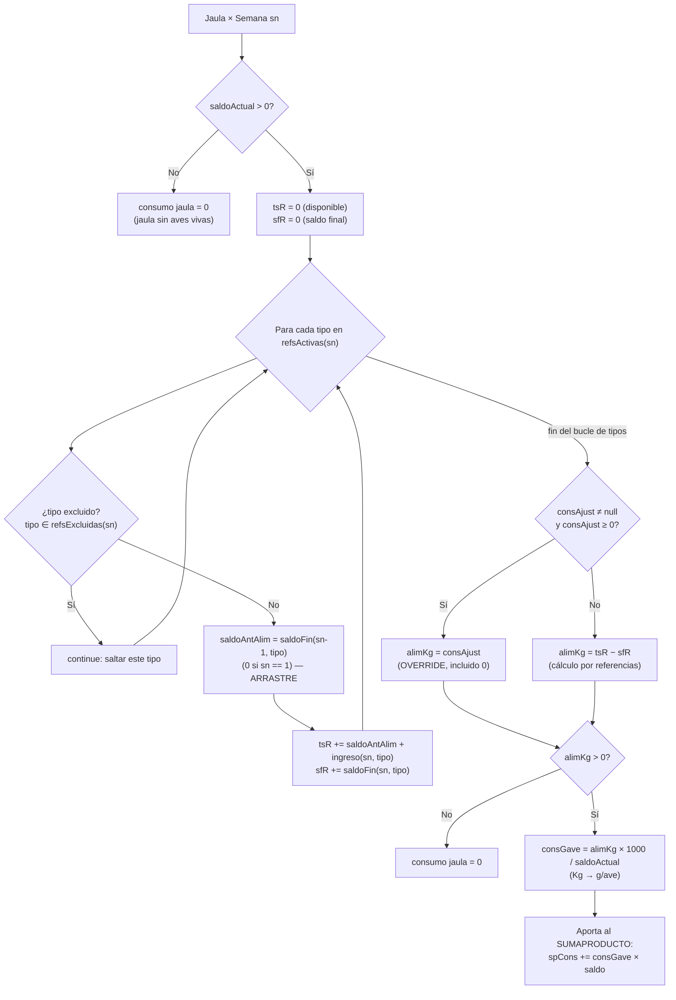

# Cálculos de DigitadorAvicola / Flock Tracker

Documento técnico que describe, indicador por indicador, cómo el motor de cálculo
de la app procesa los datos de un ensayo de broilers. Todo lo descrito aquí está
verificado contra el código real:

- `app/src/main/java/com/digitador/avicola/domain/Calculadora.kt`
- `app/src/main/java/com/digitador/avicola/domain/Models.kt`
- `app/src/main/java/com/digitador/avicola/domain/DateUtils.kt`

Las referencias de la forma `Calculadora.kt:NN` apuntan a la línea aproximada del
código en la versión documentada.

---

## 0. Modelo de datos: las piezas del cálculo

Antes de las fórmulas conviene fijar el vocabulario (definido en `Models.kt`):

| Concepto | Tipo | Significado |
|---|---|---|
| `Partida` | — | El lote/ensayo completo. Contiene `galeras`. |
| `Galera` | — | Una galera (galpón). Contiene `corrales`. |
| `Corral` | — | Un **corral / tratamiento** dentro de la galera. Contiene `parcelas`. |
| `Parcela` | jaula | La unidad experimental más fina ("jaula"). Tiene `inicio` (aves al poblar) y `pesoInicio` (peso total de recepción en gramos). |
| `Semana` | — | Una semana del ensayo. Tiene `numero`, `refsActivas` (alimentos vigentes esa semana) y `cerrada`. |
| `DatoParcela` | — | Lo digitado para una parcela en una semana: `mort` (7 días), `peso` (g/ave), `consAjust` (ajuste de consumo en Kg) y `refs` (mapa por tipo de alimento). |
| `RefAlimento` | — | Por tipo de alimento (BR1…BR4): `ingreso` y `saldoFin`, ambos en **Kg**. |

Jerarquía: **Partida → Galera → Corral (tratamiento) → Parcela (jaula)**.

> Nota terminológica: en el código `computeMetricasCorral` calcula las métricas de
> un **corral**, que en este ensayo equivale a un **tratamiento**. A lo largo del
> doc "corral" y "tratamiento" se usan como sinónimos.

---

## 1. Unidades: alimento en Kg, pesos en gramos

Esta es la regla de oro de todo el módulo y la fuente más común de confusión:

- **El alimento se digita en KILOGRAMOS.** Todo lo que viva en `RefAlimento`
  (`ingreso`, `saldoFin`) y en `consAjust` está en **Kg**.
- **Los pesos de las aves se digitan en GRAMOS.** `DatoParcela.peso` es el peso
  promedio en **g/ave**. `Parcela.pesoInicio` es el peso total de recepción en
  **gramos**.
- **El consumo por ave se expresa en GRAMOS/ave.** Por eso, al repartir el
  alimento (Kg) entre las aves, se multiplica por el factor de conversión.

```kotlin
/** El alimento (ingreso/saldo/ajuste) se digita en KILOGRAMOS; el consumo por
 *  ave se expresa en GRAMOS, por eso se multiplica por este factor al dividir. */
const val GRAMOS_POR_KG = 1000.0
```

La conversión aparece literalmente en dos lugares (consumo acumulado y consumo
semanal):

```kotlin
// acumulado
consumoAcum += alimKg * GRAMOS_POR_KG / saldoActual
// semanal
val consGave = if (alimKg > 0) alimKg * GRAMOS_POR_KG / saldo else 0.0
```

Conceptualmente:

```
consumo (g/ave) = alimento_consumido (Kg) × 1000 (g/Kg) / aves_vivas
```

**Por qué importa:** un error de unidad aquí (digitar gramos donde se espera Kg)
multiplica el consumo y arruina FCR, GDP y FEP. Si un FCR aparece 1000× muy alto
o muy bajo, sospechar de Kg-vs-gramos antes que de la fórmula.

> Las métricas derivadas mantienen sus unidades naturales: pesos en g, FCR
> adimensional, GDP en g/día, mortalidad y CV en fracción (×100 para %).

---

## 2. Indicadores de `computeMetricasCorral`

`computeMetricasCorral` recibe un `Corral`, el número de semana objetivo `semNum`,
la `Semana` objetivo, **todas** las semanas, el mapa `datosPorParcela` (parcelaId →
semana → `DatoParcela`) y el mapa de referencias excluidas por semana. Devuelve
`MetricasCorral?` (null si el corral no tiene parcelas o si no queda saldo vivo).

El método tiene **dos pasadas**:

1. **Primera pasada**: recorre cada parcela semana por semana de 1 a `semNum` para
   acumular **consumo acumulado** y **mortalidad acumulada**. Aquí vive el arrastre
   de saldos.
2. **Segunda pasada**: para la semana objetivo, calcula los SUMAPRODUCTO ponderados
   (peso, consumo, FCR, GDP, etc.).

Casi todos los indicadores son **promedios ponderados por el saldo de aves** de
cada parcela. La mecánica es siempre la misma: se acumula `Σ(valor_jaula ×
saldo_jaula)` y al final se divide por `Σ(saldo_jaula)` (= `totSaldo`). Esto es el
equivalente al SUMAPRODUCTO de la planilla Excel.

A continuación, indicador por indicador.

---

### 2.1 Saldo de aves (`totSaldo`)

**Definición.** Aves vivas al final de la semana objetivo, sumadas sobre las
parcelas del corral. El saldo de una parcela arranca en `inicio` y se le resta la
mortalidad acumulada hasta esa semana.

```kotlin
val saldoAnt = getSaldoAnterior(semNum, par.id, par, datosByPar)
val d = datosByPar[semNum]
val mort = d?.mort?.sumOf { it ?: 0 } ?: 0
val saldo = saldoAnt - mort
if (saldo <= 0) continue
totSaldo += saldo
```

**Fórmula.**

```
saldo_jaula(semNum) = inicio − Σ_{i=1..semNum} mortalidad_diaria(i)
totSaldo            = Σ_jaulas  saldo_jaula(semNum)   [solo jaulas con saldo > 0]
```

**Ponderación.** No se pondera: es una suma directa. Pero `totSaldo` es **el peso
(weight) de casi todos los demás indicadores**.

**Ejemplo.** Jaula A: inicio 100, mortalidad acumulada 4 → saldo 96. Jaula B:
inicio 100, mortalidad 6 → saldo 94. `totSaldo = 190`.

**Casos borde.**
- Una parcela con `saldo <= 0` se **salta** (`continue`): no aporta a `totSaldo` ni
  a ninguna métrica.
- Si `totSaldo <= 0` al final, la función devuelve `null`: el corral entero queda
  sin métricas esa semana.
- `getSaldoAnterior` nunca devuelve negativo (ver §4), así que una mortalidad mal
  cargada > aves no arrastra negativos.

---

### 2.2 Peso promedio (`promPeso`)

**Definición.** Peso vivo promedio por ave del corral (g/ave), ponderado por el
saldo de cada jaula.

```kotlin
val pesoGave = d?.peso ?: 0.0
if (pesoGave > 0) {
    spPeso += pesoGave * saldo
    promArr.add(pesoGave)
}
val promPeso = spPeso / totSaldo
```

**Fórmula.**

```
promPeso = Σ_jaulas (peso_jaula × saldo_jaula) / Σ_jaulas saldo_jaula
```

**Ponderación.** Por saldo de aves.

**Ejemplo.** Jaula A: peso 2200 g, saldo 96 → aporte 211 200. Jaula B: peso 2100 g,
saldo 94 → aporte 197 400. `promPeso = (211200 + 197400) / 190 ≈ 2150,5 g`.

**Casos borde.**
- Una jaula con `peso == 0` (o null) **no** aporta a `spPeso` ni a `promArr`, pero
  su saldo sí está en `totSaldo`. Esto **diluye** el promedio. Mientras una semana
  esté a medio digitar, `promPeso` puede salir bajo; se estabiliza al completar
  todos los pesos.
- `promArr` (la lista de pesos crudos sin ponderar) se usa solo para el CV (§2.12).

---

### 2.3 Consumo semanal (`consumoGave`)

Es el indicador más sutil. Tiene tres ingredientes: (a) el **arrastre** del saldo
de alimento de la semana anterior, (b) el **override** por `consAjust`, y (c) la
**exclusión** de referencias.

**Definición.** Gramos de alimento consumidos por ave durante la semana objetivo.

**Cálculo del alimento consumido (Kg) por jaula.** Se suma sobre las referencias
activas **no excluidas** el alimento "entrado" (saldo anterior + ingreso) y se le
resta el saldo final:

```kotlin
var tsR = 0.0; var sfR = 0.0
val exclSem = refsExcluidasPorSemana[semNum] ?: emptySet()
for (tipo in semana.refsActivas) {
    if (tipo in exclSem) continue   // referencia desechada del cálculo (esa semana)
    tsR += getSaldoAlimRef(semNum, par.id, tipo, datosByPar) + (d?.refs?.get(tipo)?.ingreso ?: 0.0)
    sfR += d?.refs?.get(tipo)?.saldoFin ?: 0.0
}
val alimKg = (d?.consAjust?.takeIf { it >= 0.0 }) ?: (tsR - sfR)
val consGave = if (alimKg > 0) alimKg * GRAMOS_POR_KG / saldo else 0.0
spCons += consGave * saldo
val consumoGave = spCons / totSaldo
```

**Fórmula (por jaula, por tipo de alimento no excluido).**

```
alimento_disponible = saldoAnterior_alim + ingreso     (Kg)
alimento_consumido  = alimento_disponible − saldoFin    (Kg)

alimKg_jaula = Σ_tipos (saldoAnterior_alim + ingreso − saldoFin)
             [salvo override: si consAjust ≥ 0 → alimKg_jaula = consAjust]

consGave_jaula = alimKg_jaula × 1000 / saldo_jaula      (g/ave)

consumoGave = Σ_jaulas (consGave_jaula × saldo_jaula) / Σ_jaulas saldo_jaula
```

#### (a) Arrastre del `saldoFin` entre semanas

El "saldo anterior" del alimento de la semana N **es el `saldoFin` de la semana
N−1** para ese mismo tipo. Eso lo provee `getSaldoAlimRef`:

```kotlin
fun getSaldoAlimRef(semNum, parcelaId, tipo, datosByParcela): Double {
    if (semNum <= 1) return 0.0
    return datosByParcela[semNum - 1]?.refs?.get(tipo)?.saldoFin ?: 0.0
}
```

Es decir, lo que sobró en la tolva al cerrar una semana se "arrastra" como stock
inicial de la siguiente. En semana 1 el saldo anterior es 0 (no hay semana 0).

#### (b) `consAjust` como override (cuando ≥ 0)

`consAjust` es un **ajuste manual de consumo en Kg**. Su semántica:

- `consAjust == null` → **sin ajuste**: se usa el cálculo por referencias (`tsR − sfR`).
- `consAjust >= 0.0` → **reemplaza** por completo el cálculo por referencias,
  **incluido un 0 explícito** (un `consAjust = 0.0` fuerza consumo cero).
- `consAjust < 0.0` → se ignora (se trata como "sin ajuste"), gracias al
  `takeIf { it >= 0.0 }`.

#### (c) Exclusión de referencias

Si un tipo de alimento está en `refsExcluidasPorSemana[semNum]`, se **salta** en el
bucle (`continue`): no suma ni ingreso ni saldo. Ver §5.

**Ejemplo (con arrastre).** Jaula con saldo 96 aves, alimento BR2:
- Saldo anterior (saldoFin de la semana previa): 5 Kg.
- Ingreso de esta semana: 150 Kg.
- Saldo final de esta semana: 8 Kg.
- `alimKg = 5 + 150 − 8 = 147 Kg`.
- `consGave = 147 × 1000 / 96 ≈ 1531,25 g/ave`.

**Ejemplo (con override `consAjust`).** Misma jaula, pero `consAjust = 140.0`:
- `alimKg = 140` (se ignora el cálculo de referencias).
- `consGave = 140 × 1000 / 96 ≈ 1458,33 g/ave`.

**Casos borde.**
- `alimKg <= 0` (saldoFin ≥ disponible, p.ej. carga incompleta) → `consGave = 0`
  para esa jaula.
- Todas las referencias excluidas y sin `consAjust` → `tsR = sfR = 0` → `alimKg = 0`
  → consumo 0.

---

### 2.4 Consumo acumulado (`consumoAcum`)

**Definición.** Gramos de alimento por ave acumulados desde la semana 1 hasta
`semNum`. Se computa en la **primera pasada**, semana por semana, y luego se
pondera por el saldo de la semana objetivo.

```kotlin
var runningSaldo = par.inicio
for (sn in 1..semNum) {
    ...
    val mort = d?.mort?.sumOf { it ?: 0 } ?: 0
    val saldoActual = runningSaldo - mort
    mortAcum += mort
    if (saldoActual > 0) {
        var tsR = 0.0; var sfR = 0.0
        val exclSn = refsExcluidasPorSemana[sn] ?: emptySet()
        for (tipo in s.refsActivas) {
            if (tipo in exclSn) continue
            val saldoAntAlim = if (sn == 1) 0.0 else (datosByPar[sn-1]?.refs?.get(tipo)?.saldoFin ?: 0.0)
            tsR += saldoAntAlim + (d?.refs?.get(tipo)?.ingreso ?: 0.0)
            sfR += d?.refs?.get(tipo)?.saldoFin ?: 0.0
        }
        val alimKg = (d?.consAjust?.takeIf { it >= 0.0 }) ?: (tsR - sfR)
        if (alimKg > 0) {
            consumoAcum += alimKg * GRAMOS_POR_KG / saldoActual
        }
    }
    runningSaldo = saldoActual
}
```

**Fórmula.**

```
consumoAcum_jaula = Σ_{sn=1..semNum}  [ alimKg(sn) × 1000 / saldoActual(sn) ]
                    (solo semanas con saldoActual > 0 y alimKg > 0)

consumoAcum = Σ_jaulas (consumoAcum_jaula × saldo_objetivo_jaula) / totSaldo
```

**Detalle importante:** el consumo de cada semana se divide por el saldo **de esa
semana** (`saldoActual`), no por el de la semana objetivo. Así, el g/ave de cada
semana refleja las aves vivas en ese momento, y se van **sumando** los g/ave
semanales. Es una suma de consumos por ave, no un consumo total dividido por aves
finales.

**Ejemplo.** Una jaula que en S1 consumió 160 g/ave, en S2 480 g/ave y en S3 820
g/ave → `consumoAcum_jaula = 160 + 480 + 820 = 1460 g/ave`.

**Casos borde.**
- Cada semana usa **sus propias** `refsActivas` y **sus propias** exclusiones
  (`refsExcluidasPorSemana[sn]`), no las de la semana objetivo.
- Una semana sin alimento cargado (`alimKg <= 0`) simplemente no suma.

---

### 2.5 FCR semanal (`fcrSem`)

**Definición.** Índice de conversión alimenticia de la semana (g de alimento por g
de ganancia). En esta app es el **promedio ponderado de los FCR individuales de
cada jaula**, no un cociente de agregados.

```kotlin
if (gain > 0) {
    spGdp += (gain / 7.0) * saldo
    if (consGave > 0) {
        spFcr += (consGave / gain) * saldo
        fcrCount += saldo
    }
}
val fcrSem = if (fcrCount > 0) spFcr / fcrCount else null
```

**Fórmula.**

```
FCR_jaula = consGave_jaula / gain_jaula        (ambos en g/ave)
fcrSem    = Σ_jaulas (FCR_jaula × saldo_jaula) / Σ_jaulas saldo_jaula
            (solo jaulas con gain > 0 y consGave > 0)
```

**Ponderación.** Por saldo, pero el denominador es `fcrCount`, que **solo acumula
los saldos de las jaulas que efectivamente aportaron FCR** (con ganancia y consumo
positivos). Por eso `fcrCount` puede ser menor que `totSaldo`.

**Ejemplo.** Jaula A: consGave 1531 g, gain 920 g → FCR 1,664; saldo 96. Jaula B:
consGave 1460 g, gain 880 g → FCR 1,659; saldo 94.
`fcrSem = (1,664×96 + 1,659×94) / (96+94) ≈ 1,661`.

> Es un promedio de ratios, **no** `Σconsumo / Σganancia`. Da resultados muy
> parecidos cuando las jaulas son homogéneas, pero diverge si hay jaulas con
> consumos o ganancias muy dispares.

---

### 2.6 FCR acumulado (`fcrAcum`)

**Definición.** Conversión alimenticia acumulada de todo el período: consumo
acumulado por ave dividido por el peso vivo promedio actual.

```kotlin
val fcrAcum = if (promPeso > 0 && consumoAcum > 0) consumoAcum / promPeso else null
```

**Fórmula.**

```
fcrAcum = consumoAcum (g/ave) / promPeso (g/ave)
```

A diferencia del FCR semanal, este **sí** es un cociente de agregados (ambos ya
ponderados por saldo). Es la métrica de conversión "oficial" que alimenta FEP y FCR
ajustado.

**Ejemplo.** `consumoAcum = 3400 g/ave`, `promPeso = 2150,5 g` →
`fcrAcum = 3400 / 2150,5 ≈ 1,581`.

---

### 2.7 Ganancia de peso semanal (`gain`) — insumo de FCR/GDP

No es un campo de salida de `MetricasCorral`, pero es el insumo de FCR semanal y GDP
semanal, así que se documenta aquí.

```kotlin
val gain = if (semNum == 1) {
    pesoGave
} else {
    val prevGave = if (semNum > 1) datosByPar[semNum - 1]?.peso ?: 0.0 else 0.0
    if (pesoGave > 0 && prevGave > 0) pesoGave - prevGave else 0.0
}
```

**Fórmula.**

```
gain_jaula = peso_actual                         si semNum == 1
           = peso_actual − peso_semana_anterior  si semNum >= 2 (y ambos > 0)
           = 0                                    si falta alguno de los dos pesos
```

**Por qué semana 1 toma el peso completo:** según el comentario del código, en la
primera semana se considera toda la masa como ganancia (no se descuenta el peso de
recepción para la ganancia). El peso de recepción **sí** se usa, pero solo para el
`ratio` (§2.11), no para `gain`.

**Caso borde.** Si falta el peso de la semana anterior (semana previa no digitada),
`gain = 0` y la jaula no aporta a FCR semanal ni a GDP semanal aunque tenga consumo.

---

### 2.8 GDP semanal (`gdpSem`)

**Definición.** Ganancia diaria de peso de la semana (g/día), promediada linealmente
sobre 7 días y ponderada por saldo.

```kotlin
if (gain > 0) {
    spGdp += (gain / 7.0) * saldo
}
gdpSem = spGdp / totSaldo
```

**Fórmula.**

```
gdpSem_jaula = gain_jaula / 7
gdpSem       = Σ_jaulas (gdpSem_jaula × saldo_jaula) / totSaldo
```

**Ponderación.** Por saldo, dividiendo por `totSaldo` (no por `fcrCount`). Ojo: una
jaula con `gain <= 0` no aporta numerador pero su saldo **sí** está en `totSaldo`,
así que diluye levemente el GDP si hay jaulas sin ganancia.

**Ejemplo.** `gain = 920 g` en una semana → `gdpSem_jaula = 920 / 7 ≈ 131,4 g/día`.

---

### 2.9 GDP lineal (`gdpLineal`)

**Definición.** Ganancia diaria promedio "de toda la vida": peso promedio actual
dividido por la edad en días (asumiendo peso inicial 0).

```kotlin
val edadDias = semNum * 7.0
gdpLineal = if (promPeso > 0) promPeso / edadDias else 0.0
```

**Fórmula.**

```
edadDias  = semNum × 7
gdpLineal = promPeso / edadDias
```

**Ejemplo.** Semana 5 → `edadDias = 35`. `promPeso = 2150,5 g` →
`gdpLineal = 2150,5 / 35 ≈ 61,4 g/día`.

**Diferencia con GDP semanal:** `gdpLineal` es el promedio desde el día 0 (incluye el
arranque lento de las primeras semanas); `gdpSem` es la velocidad de la última
semana (más alta en la fase de engorde). Comparar ambos muestra la aceleración del
crecimiento.

---

### 2.10 Mortalidad acumulada % (`mortAcumPct`)

**Definición.** Fracción de aves muertas desde el inicio respecto al total de aves
pobladas en el corral.

```kotlin
totInicio += par.inicio
totMortAcum += (mortAcumByParcela[par.id] ?: 0)
val mortAcumPct = if (totInicio > 0) totMortAcum.toDouble() / totInicio else 0.0
```

**Fórmula.**

```
mortAcumPct = Σ_jaulas mortalidad_acumulada_jaula / Σ_jaulas inicio_jaula
```

Es una **fracción** (0–1). Para mostrarla como porcentaje se multiplica por 100 en
la UI/export.

**Detalle importante:** el denominador es `totInicio` (aves pobladas), que se
acumula **para todas** las parcelas, incluso las que ya tienen `saldo <= 0` (la suma
de `totInicio`/`totMortAcum` está **antes** del `if (saldo <= 0) continue`). Así,
una jaula que perdió todas sus aves sigue contando en la mortalidad acumulada del
corral, aunque no aporte a peso/consumo.

**Ejemplo.** `totMortAcum = 22`, `totInicio = 800` →
`mortAcumPct = 22/800 = 0,0275 = 2,75 %`.

---

### 2.11 Ratio (solo semana 1) (`ratio`)

**Definición.** Cociente entre el peso promedio de la semana 1 y el peso promedio de
recepción. Mide cuánto multiplicó su peso el ave en la primera semana. **Solo existe
en la semana 1**; en cualquier otra semana es `null`.

```kotlin
val actualPrevGave = if (semNum > 1) {
    datosByPar[semNum - 1]?.peso ?: 0.0
} else if (par.inicio > 0) {
    par.pesoInicio / par.inicio
} else 0.0
if (actualPrevGave > 0) spPrevPeso += actualPrevGave * saldo
val ratio = if (semNum == 1 && spPrevPeso > 0) promPeso / (spPrevPeso / totSaldo) else null
```

**Fórmula (semana 1).**

```
pesoRecepcion_jaula = pesoInicio / inicio          (g/ave de recepción)
promRecepcion       = Σ (pesoRecepcion_jaula × saldo) / totSaldo
ratio               = promPeso(S1) / promRecepcion
```

**Ejemplo.** Recepción: pesoInicio 4500 g / 100 aves = 45 g/ave. Peso S1: 180 g/ave.
`ratio = 180 / 45 = 4,0` (cuadruplicó su peso).

---

### 2.12 CV % del peso (`cvPeso`)

**Definición.** Coeficiente de variación de los pesos promedio de las jaulas del
corral: dispersión relativa de la uniformidad entre jaulas. Se calcula con
desviación estándar **muestral (n−1)** dividida por la media, **sin ponderar por
saldo**.

```kotlin
cvPeso = if (promArr.size >= 2) stdev(promArr) / promArr.average() else null

private fun stdev(arr: List<Double>): Double {
    if (arr.size < 2) return 0.0
    val m = arr.average()
    return sqrt(arr.sumOf { (it - m) * (it - m) } / (arr.size - 1))
}
```

**Fórmula.**

```
media = promedio simple de los pesos de las jaulas (sin ponderar)
desv  = sqrt( Σ (peso_jaula − media)² / (n − 1) )      ← muestral
cvPeso = desv / media                                   (fracción; ×100 = %)
```

**Importante:** este CV usa **n−1** (estimador muestral) y **no pondera** por saldo
—cada jaula cuenta igual—, a diferencia de `promPeso` que sí pondera. Es
intencional: replica el comportamiento de la planilla.

**Ejemplo.** Pesos de jaulas: [2200, 2100, 2250]. media = 2183,33.
desv ≈ 76,38. `cvPeso = 76,38 / 2183,33 ≈ 0,0350 = 3,50 %`.

**Casos borde.** Menos de 2 jaulas con peso → `null` (no se puede estimar
dispersión muestral).

---

### 2.13 CGR (`cgr`) — ganancia compuesta respecto a recepción

**Definición.** Razón entre el peso actual y el peso promedio de recepción de la
jaula (cuántas veces multiplicó su peso desde el día 0). Promedio ponderado por
saldo.

```kotlin
val promInicio = if (par.inicio > 0) par.pesoInicio / par.inicio else 0.0
if (pesoGave > 0 && promInicio > 0) { spCgr += (pesoGave / promInicio) * saldo; cgrCount += saldo }
cgr = if (cgrCount > 0) spCgr / cgrCount else null
```

**Fórmula.**

```
cgr_jaula = peso_actual / (pesoInicio / inicio)
cgr       = Σ (cgr_jaula × saldo) / Σ saldo   (sobre jaulas con peso y recepción > 0)
```

---

### 2.14 FEP — Factor de Eficiencia Productiva (`fep`)

**Definición.** Índice europeo de eficiencia productiva (EPEF/IEP), que combina
viabilidad, peso, edad y conversión en un solo número (mayor = mejor).

```kotlin
val fep = if (fcrAcum != null && fcrAcum > 0 && edadDias > 0) {
    val viabilidad = 1.0 - mortAcumPct
    ((viabilidad * (promPeso / 1000.0)) / (edadDias * fcrAcum)) * 100.0
} else null
```

**Fórmula.**

```
viabilidad = 1 − mortAcumPct                 (fracción de aves vivas)
FEP = [ viabilidad × (promPeso / 1000) ] / (edadDias × fcrAcum) × 100
```

Notar la conversión `promPeso / 1000`: el FEP usa el peso en **Kg**, por eso se
divide por 1000.

**Ejemplo.** viabilidad = 1 − 0,0275 = 0,9725; promPeso = 2150,5 g → 2,1505 Kg;
edadDias = 35; fcrAcum = 1,581.
`FEP = (0,9725 × 2,1505) / (35 × 1,581) × 100 ≈ 377,9`.

> Es una de las "métricas adicionales" que por defecto **no** se exportan a Excel
> (`OpcionesExport.incluirFep`).

---

### 2.15 FCR ajustado a peso estándar (`fcrAdj`) — solo semana ≥ 5

**Definición.** FCR acumulado corregido a un peso de referencia de 2500 g, para
comparar lotes que difieren en peso. Solo se calcula **a partir de la semana 5**.

```kotlin
val fcrAdj = if (semNum >= 5 && fcrAcum != null && promPeso > 0) fcrAcum + (2500.0 - promPeso) / 3200.0 else null
```

**Fórmula (semNum ≥ 5).**

```
fcrAdj = fcrAcum + (2500 − promPeso) / 3200
```

- Si el lote pesa **menos** de 2500 g, el término es positivo → penaliza (FCR
  ajustado mayor).
- Si pesa **más** de 2500 g, el término es negativo → bonifica.
- El divisor 3200 es el factor de corrección estándar.

**Ejemplo.** Semana 5, `fcrAcum = 1,581`, `promPeso = 2150,5 g`:
`fcrAdj = 1,581 + (2500 − 2150,5)/3200 ≈ 1,690`.

---

## 3. CV por tratamiento / galera / global: `cvPesoDeParcelas`

`computeMetricasCorral` calcula el CV **dentro de un corral** (`cvPeso`, §2.12). Para
CV a **otros niveles** (un tratamiento que abarca varias jaulas, una galera o todo el
lote) existe `cvPesoDeParcelas`:

```kotlin
fun cvPesoDeParcelas(parcelas, semNum, datosPorParcela): CvPeso? {
    val pesos = mutableListOf<Double>()
    for (par in parcelas) {
        val datosByPar = datosPorParcela[par.id] ?: emptyMap()
        val saldoAnt = getSaldoAnterior(semNum, par.id, par, datosByPar)
        val mort = datosByPar[semNum]?.mort?.sumOf { it ?: 0 } ?: 0
        val saldo = saldoAnt - mort
        val peso = datosByPar[semNum]?.peso ?: 0.0
        if (saldo > 0 && peso > 0) pesos.add(peso)
    }
    if (pesos.size < 2) return null
    return CvPeso(n = pesos.size, media = pesos.average(), desv = stdev(pesos))
}
```

**Qué hace.** Recibe **cualquier** lista de parcelas (las de un tratamiento, las de
una galera, o todas), toma de cada una su peso g/ave en `semNum` **solo si la jaula
tiene aves vivas y peso digitado**, y construye un `CvPeso`:

- `n` = número de jaulas válidas,
- `media` = promedio **simple** de los pesos (sin ponderar),
- `desv` = desviación estándar **muestral (n−1)** (mismo `stdev` que en §2.12).

El consumidor obtiene el porcentaje vía la propiedad `CvPeso.cv`:

```kotlin
val cv: Double get() = if (media > 0) desv / media else 0.0   // ×100 = %
val dosSigma: Double get() = desv * 2.0                        // banda ±2σ
```

**Cómo se usa para los tres niveles.** Es la misma función con distinto conjunto de
parcelas de entrada:

- **CV por tratamiento:** se le pasan las parcelas de un corral/tratamiento.
- **CV por galera:** se le pasan todas las parcelas de la galera (todos sus corrales).
- **CV global / del lote:** se le pasan todas las parcelas de la partida.

---

## 4. Saldos de referencia: `getSaldoAnterior` y `getSaldoAlimRef`

### 4.1 `getSaldoAnterior` (aves)

```kotlin
fun getSaldoAnterior(semNum, parcelaId, parcela, datosByParcela): Int {
    var currentSaldo = parcela.inicio
    for (i in 1 until semNum) {
        val mort = datosByParcela[i]?.mort?.sumOf { it ?: 0 } ?: 0
        currentSaldo -= mort
    }
    return currentSaldo.coerceAtLeast(0)
}
```

**Qué devuelve.** Las aves vivas **al inicio** de la semana `semNum` (= inicio menos
toda la mortalidad de las semanas **anteriores**, `1 until semNum`, sin incluir
`semNum`). Quien lo llama luego resta la mortalidad de la propia semana para obtener
el saldo final.

**`coerceAtLeast(0)`** es la red de seguridad: si por un error de digitación la
mortalidad acumulada supera las aves pobladas, el saldo quedaría negativo;
`coerceAtLeast(0)` lo recorta a 0 para **no arrastrar negativos**.

### 4.2 `getSaldoAlimRef` (alimento)

```kotlin
fun getSaldoAlimRef(semNum, parcelaId, tipo, datosByParcela): Double {
    if (semNum <= 1) return 0.0
    return datosByParcela[semNum - 1]?.refs?.get(tipo)?.saldoFin ?: 0.0
}
```

**Qué devuelve.** El stock inicial de alimento de la semana `semNum` para el `tipo`
dado = el `saldoFin` de **ese mismo tipo** en la semana anterior. Es el mecanismo de
**arrastre** del alimento entre semanas (§2.3a). En semana 1 (o sin dato previo)
devuelve 0.0.

---

## 5. Referencias excluidas (check "Excluir", por semana)

Una **referencia excluida** es un tipo de alimento (BR1…BR4) que está activo esa
semana pero que el usuario marcó como "Excluir". Se modela como
`refsExcluidasPorSemana: Map<Int, Set<String>>` (semana → conjunto de tipos
excluidos) en el cálculo, y como `refsExcluidas: Set<String>` en la validación.

### 5.1 Efecto en el consumo

En los bucles de consumo (acumulado y semanal) la referencia excluida se **salta**
con `continue`:

```kotlin
for (tipo in semana.refsActivas) {
    if (tipo in exclSem) continue   // referencia desechada del cálculo (esa semana)
    ...
}
```

Consecuencia: el alimento de esa referencia **no suma** ni a `tsR` (disponible) ni a
`sfR` (saldo final), así que **no participa** del consumo de esa semana.

> El override `consAjust` es independiente de la exclusión: si hay `consAjust ≥ 0`,
> reemplaza al resultado de `tsR − sfR` cualquiera sea el estado de exclusión.

### 5.2 Efecto en la validación

En `validarSemana` las **referencias exigidas** son las activas **menos** las
excluidas:

```kotlin
val refsReq = refsActivas.filter { it !in refsExcluidas }
```

Una referencia excluida deja de ser exigida: no bloquea el cierre de la semana
aunque su ingreso esté vacío (ver §6).

---

## 6. Validación y progreso

### 6.1 `validarSemana` — reglas de "Terminar semana"

Determina si una semana está lo bastante completa para cerrarla. Devuelve
`ValidacionSemana(totalParcelas, faltanPeso, faltanAlimento)`; la semana es
`completa` cuando `total > 0 && faltanPeso == 0 && faltanAlimento == 0`.

**Parcelas consideradas:** todas las de la partida con `inicio != 0` (las jaulas
vacías no se exigen).

**(a) Peso — siempre exigido a todas las parcelas:** cada parcela con aves debe
tener `peso` no nulo; `faltanPeso` cuenta las que faltan.

**(b) Alimento — lógica flexible.** Primero define las **referencias exigidas**
(activas no excluidas). El alimento se da por **completo** (`faltanAlimento = 0`) si
se cumple **alguna** de estas condiciones:

1. **No hay referencias exigidas** (todas las activas están excluidas) → el alimento
   no bloquea.
2. **Alguna referencia exigida tiene TODA su columna de INGRESO llena**: basta con
   que **un** tipo de alimento exigido tenga ingreso en **todas** las parcelas con
   aves.
3. **Cada parcela tiene el ingreso de todas las referencias exigidas**: si la
   condición 2 no se cumple, se cuenta cuántas parcelas **no** tienen el ingreso de
   **todas** las exigidas.

```kotlin
val algunaColumnaCompleta = refsReq.any { tipo -> parcelas.all { tieneIng(it, tipo) } }
val faltanAlimento = if (refsReq.isEmpty() || algunaColumnaCompleta) 0
    else parcelas.count { par -> !refsReq.all { tieneIng(par, it) } }
```

`tieneIng` mira solo el **ingreso** (no el `saldoFin`). El saldoFin afecta el cálculo
del consumo pero no bloquea el cierre.

### 6.2 `calcProgreso` y `calcProgresoGalera` — barra de progreso

A diferencia de la validación (estricta), la **barra de progreso** usa una regla laxa
con `any`: una parcela cuenta como "con alimento" si tiene ingreso de **alguna**
referencia activa.

Por cada parcela con aves cuenta **2 ítems** (peso + alimento): +1 si `peso != null`,
+1 si **alguna** ref activa tiene ingreso. Además lleva la mortalidad (7 días por
parcela). `calcProgresoGalera` es idéntico pero restringido a una galera.

**Diferencia clave validación vs. progreso:**

| | Peso | Alimento |
|---|---|---|
| `validarSemana` (cerrar) | todas las parcelas con `peso` | reglas (a)/(b)/(c), por **ingreso** de refs **exigidas** |
| `calcProgreso` (barra) | cada parcela con `peso` | `any` ref activa con ingreso |

La barra puede llegar a 100 % aunque la validación estricta aún reporte faltantes.

---

## 7. Diagrama: consumo por jaula/semana



---

## Apéndice: tabla resumen de indicadores de `MetricasCorral`

| Indicador | Campo | Ponderación | Fórmula resumida |
|---|---|---|---|
| Saldo aves | `saldo` | suma | `Σ (inicio − Σmort)` jaulas vivas |
| Peso promedio | `promPeso` | por saldo | `Σ(peso×saldo)/Σsaldo` |
| Consumo semanal | `consumoGave` | por saldo | `alimKg×1000/saldo`, prom. pond. |
| Consumo acumulado | `consumoAcum` | por saldo | `Σ_sem (alimKg×1000/saldoSem)`, pond. |
| FCR semanal | `fcrSem` | por saldo (fcrCount) | prom. pond. de `consGave/gain` |
| FCR acumulado | `fcrAcum` | agregados | `consumoAcum/promPeso` |
| GDP semanal | `gdpSem` | por saldo | prom. pond. de `gain/7` |
| GDP lineal | `gdpLineal` | — | `promPeso/(semNum×7)` |
| Mortalidad acum. % | `mortAcumPct` | — | `ΣmortAcum/Σinicio` |
| CV % peso | `cvPeso` | sin ponderar (n−1) | `stdev(pesos)/media` |
| CGR | `cgr` | por saldo | prom. pond. de `peso/(pesoInicio/inicio)` |
| Ratio (solo S1) | `ratio` | por saldo | `promPeso / promRecepcion` |
| FEP | `fep` | — | `viab×(peso/1000)/(edad×fcrAcum)×100` |
| FCR ajustado (S≥5) | `fcrAdj` | — | `fcrAcum + (2500−promPeso)/3200` |

> Recordatorio de unidades: **alimento en Kg** (×1000 → g/ave), **pesos en gramos**,
> **FEP usa peso en Kg** (÷1000). Mortalidad y CV son fracciones (×100 para %).
