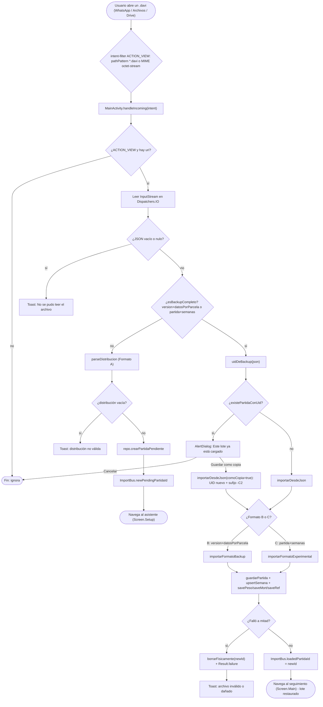

# Formato `.davi` y exportación (Excel / PDF)

> Documentación técnica de **DigitadorAvicola / Flock Tracker** basada en el código real.
> Archivos fuente principales:
> - `app/src/main/java/com/digitador/avicola/data/repository/ExportService.kt`
> - `app/src/main/java/com/digitador/avicola/MainActivity.kt`
> - `app/src/main/AndroidManifest.xml`
> - `app/src/main/res/xml/file_paths.xml`
> - `app/src/main/java/com/digitador/avicola/domain/Models.kt` (estructura de los datos)

---

## 1. Formato `.davi` (importación)

Un archivo `.davi` es simplemente **texto JSON**. La app lo abre cuando el usuario toca el archivo desde WhatsApp, Archivos, Drive, etc. (ver §1.6). El contenido del archivo se lee y se decide qué hacer según su **forma**, no según su nombre.

La app reconoce **tres formatos**:

| # | Nombre | Estructura | Qué hace al importar | Función |
|---|--------|-----------|----------------------|---------|
| A | **Distribución pura** | `{"G1":{"K1":[ids]}}` | Crea un lote **PENDIENTE** y abre el asistente de completado | `parseDistribucion` (`MainActivity.kt`) |
| B | **Respaldo completo** (`BackupDump`) | `version`, `exportedAt`, `partida`, `semanas`, `datosPorParcela` | Restaura el lote **completo** y va directo al seguimiento | `importarFormatoBackup` (`ExportService.kt`) |
| C | **Experimental** | `partida` + `semanas` con `datos` anidados galera→corral→parcela | Restaura el lote completo (formato alternativo) | `importarFormatoExperimental` (`ExportService.kt`) |

> **Unidades (importante).** El **alimento va en KILOGRAMOS** (`ingreso`, `saldoFin`, `consAjust`). La `Calculadora` multiplica por `GRAMOS_POR_KG = 1000` para obtener consumo en g/ave (`alimKg * GRAMOS_POR_KG / saldo`). Los **pesos van en GRAMOS**: `pesoInicio` es el peso total recibido (g) y `peso` es el promedio g/ave de la semana.
>
> ⚠️ Los archivos `PROMPT_DAVI.md` y `gen_davi.py` (fuera de este repo) dicen que el alimento va en **gramos**: están **desactualizados**. Un `.davi` generado según esa documentación produce métricas de alimento infladas ×1000. Los `.davi` exportados por la propia app y los construidos desde la planilla (en kg) hacen *round-trip* correcto.

### 1.1 Detección del formato

El orden de decisión está en `MainActivity.handleIncoming` y en `ExportService.esBackupCompleto`:

```kotlin
fun esBackupCompleto(json: String): Boolean = try {
    val root = JsonParser.parseString(json).asJsonObject
    (root.has("version") && root.has("datosPorParcela")) ||   // → Formato B
        (root.has("partida") && root.has("semanas"))           // → Formato C
} catch (e: Exception) { false }
```

Flujo en `handleIncoming`:

1. Si `esBackupCompleto(json)` es `true` → es respaldo (B o C).
   - Se lee el UID con `uidDeBackup`.
   - Si el UID ya existe (`repo.existePartidaConUid`) → **diálogo de duplicado** (ver §1.4).
   - Si no existe → `importarDesdeJson(json)`, que vuelve a discriminar B vs C:
     ```kotlin
     when {
         jsonRoot.has("version") && jsonRoot.has("datosPorParcela") -> importarFormatoBackup(json, comoCopia)
         jsonRoot.has("partida") && jsonRoot.has("semanas")         -> importarFormatoExperimental(json)
         else -> Result.failure(IllegalArgumentException("Formato no reconocido"))
     }
     ```
2. Si **no** es backup → se intenta `parseDistribucion(json)` (Formato A). Si la distribución queda vacía → Toast `"El archivo no contiene una distribución válida"`.

> Nota: la convención de IDs de parcela (`G1A01`, letra de línea, etc.) **no la valida el código**. Solo se interpretan: los dígitos de `galera.id` (→ "bloque" en el Excel) y `corral.id.substringAfterLast("-")` (→ tratamiento). La repetición es el índice de la parcela dentro del corral. Los IDs son convención humana.

---

### 1.2 Formato A — Distribución pura

Mapa anidado `galera → tratamiento → [ids de parcela]`. Crea un lote pendiente (`repo.crearPartidaPendiente`) y abre el asistente (`Screen.Setup`).

```jsonc
{
  "G1": {                          // Galera 1
    "K1": ["G1A01", "G1A02"],      // Tratamiento K1 → dos parcelas/jaulas
    "K2": ["G1B01", "G1B02"]       // Tratamiento K2
  },
  "G2": {
    "K1": ["G2A01", "G2A02"],
    "K2": ["G2B01", "G2B02"]
  }
}
```

`parseDistribucion` acepta **dos sub-formas**:

- **Distribución pura** (la de arriba): se deserializa con Gson a `Map<String, Map<String, List<String>>>`. Si falla, devuelve mapa vacío (parseo defensivo).
- **Estado con `"galeras"`**: si el JSON es un objeto con clave `galeras` (un array), se extrae de ahí la distribución leyendo `id` de galera, `id` de corral (→ tratamiento por `substringAfterLast("-")`) e `id` de cada parcela. El parseo es **defensivo**: si un nodo no calza, se **omite** en vez de lanzar excepción.

---

### 1.3 Formato B — Respaldo completo (`BackupDump`)

Es lo que **exporta la propia app** con `exportarLote`. Serializa el `data class BackupDump` con `GsonBuilder().setPrettyPrinting()`.

```jsonc
{
  "version": 1,                          // siempre 1 hoy
  "exportedAt": 1750800000000,           // epoch millis (System.currentTimeMillis)

  "partida": {                           // domain.Partida
    "id": 7,                             // se ignora: al importar se resetea a 0
    "numero": "3580",
    "lote": "Lote A",
    "edad": "1 día",
    "fechaInicio": "2026-06-01",
    "usarGuia": true,
    "finalizada": false,
    "uid": "8f3c2e10-...-c0ffee",        // UUID, clave para deduplicar (§1.4)
    "galeras": [
      {
        "id": "G1",
        "nombre": "Galera 1",
        "corrales": [
          {
            "id": "G1-K1",               // tratamiento = substringAfterLast("-") = "K1"
            "galeraId": "G1",
            "parcelas": [
              { "id": "G1A01", "corralId": "G1-K1", "inicio": 25, "pesoInicio": 1050.0 },
              { "id": "G1A02", "corralId": "G1-K1", "inicio": 25, "pesoInicio": 1040.0 }
            ]
          }
        ]
      }
    ]
  },

  "semanas": [                           // List<domain.Semana>
    {
      "numero": 1,
      "fechaInicio": "2026-06-01",
      "fechaFin": "2026-06-07",
      "refsActivas": ["BR1"],            // tipos de alimento activos esa semana
      "cerrada": false                   // true = semana terminada/bloqueada
    }
  ],

  "datosPorParcela": {                   // Map<parcelaId, Map<semanaNumero, DatoParcela>>
    "G1A01": {
      "1": {                             // semana 1
        "semanaNumero": 1,
        "parcelaId": "G1A01",
        "mort": [0, 1, null, 0, 0, 0, 0],  // 7 días (Lun..Dom); null = sin dato
        "peso": 180.5,                   // promedio g/ave (GRAMOS)
        "pesos": [178.0, 183.0],         // muestreos individuales (opcional)
        "consAjust": null,               // consumo ajustado en KG (override; null = calculado)
        "refs": {                        // Map<tipo, RefAlimento>
          "BR1": { "tipo": "BR1", "ingreso": 30.0, "saldoFin": 5.0 }  // KILOGRAMOS
        }
      }
    }
  }
}
```

Importación (`importarFormatoBackup`):

1. Resuelve **número** y **UID** finales (§1.4).
2. `partida.copy(id = 0L, numero = numeroFinal, uid = uidFinal)` → `repo.guardarPartida` devuelve el `newId`.
3. Inserta semanas (`upsertSemana`) y, por cada `DatoParcela`, guarda peso, mortalidad, `consAjust` (si no es null) y cada referencia de alimento.
4. **Importación atómica:** si algo falla en el paso 3 (JSON incompleto, campos nulos de Gson), se ejecuta `repo.borrarFisicamente(newId)` para no dejar un lote fantasma, y se devuelve `Result.failure`.

---

### 1.4 Manejo de duplicados (por UID) y copias

El `uid` de la partida (UUID) es la clave de deduplicación.

- En `handleIncoming`: si `uidDeBackup(json)` no está en blanco y `repo.existePartidaConUid(uid)` → se publica `ImportBus.duplicateBackupJson = json`, lo que dispara un **AlertDialog**:
  - Título: *"Este lote ya está cargado"*.
  - **Cancelar** → descarta.
  - **Guardar como copia** → `importarBackupComoCopia(json)` → `importarDesdeJson(json, comoCopia = true)`.
- Resolución de número/UID al importar:
  - **Copia** (`comoCopia = true`): UID nuevo (`UUID.randomUUID()`) y número con sufijo de copia vía `repo.generarNumeroCopia` (p. ej. `3580` → `3580-C2`).
  - **Directa** (`comoCopia = false`): conserva su número salvo que ya exista otro lote con ese número (`existeOtraPartidaConNumero`), en cuyo caso también genera copia para no violar la unicidad. UID: el propio del backup, o uno nuevo si venía vacío.

### 1.5 Formato C — Experimental (anidado)

Detectado por `partida` + `semanas` (sin `version`/`datosPorParcela`). Los datos van **anidados galera→corral→parcela** dentro de cada semana (`datos`). Lo parsea `importarFormatoExperimental` usando DTOs propios (`ExpRoot`, `ExpPartida`, `ExpGalera`, `ExpCorral`, `ExpParcela`, `ExpSemana`, `ExpDato`, `ExpRef`).

```jsonc
{
  "partida": {                           // ExpPartida (sin uid ni finalizada)
    "numero": "3580",
    "lote": "Lote A",
    "edad": "1 día",
    "fechaInicio": "2026-06-01",
    "galeras": [
      {
        "id": "G1",
        "nombre": "Galera 1",
        "corrales": [
          {
            "id": "G1-K1",               // tratamiento = "K1"
            "parcelas": [
              { "id": "G1A01", "inicio": 25, "pesoInicio": 1050.0 }
            ]
          }
        ]
      }
    ]
  },
  "semanas": [
    {
      "numero": 1,
      "fechaInicio": "2026-06-01",
      "fechaFin": "2026-06-07",
      "refs": ["BR1"],                   // ← aquí se llama "refs" (no "refsActivas")
      "datos": {                         // Galera → Corral → Parcela → ExpDato
        "G1": {
          "G1-K1": {
            "G1A01": {
              "mort": [0, 1, 0, 0, 0, 0, 0],
              "peso": 180.5,             // GRAMOS
              "refs": {                  // KILOGRAMOS
                "BR1": { "ingreso": 30.0, "saldoFin": 5.0 }
              },
              "consAjust": null
            }
          }
        }
      }
    }
  ]
}
```

Importación: construye un `Partida` de dominio (`id`/`uid` por defecto → 0 / vacío), lo guarda, y recorre el mapa triple `datos` guardando peso, mortalidad, `consAjust` y refs. **Misma limpieza atómica**: ante fallo, `repo.borrarFisicamente(newId)` y `Result.failure`.

---

### 1.6 Cómo llega el archivo a la app (intents)

Definido en `AndroidManifest.xml`. La `MainActivity` es `singleTask` y `exported="true"`. Hay **dos** `intent-filter` `ACTION_VIEW` para capturar `.davi` desde distintos orígenes:

1. **Por ruta / extensión**: esquemas `content` y `file`, `host="*"`, `mimeType="*/*"`, con `pathPattern` para `.davi` (hasta varios puntos en el nombre):
   ```xml
   <data android:pathPattern=".*\\.davi" />
   <data android:pathPattern=".*\\..*\\.davi" />
   <data android:pathPattern=".*\\..*\\..*\\.davi" />
   <data android:pathPattern=".*\\..*\\..*\\..*\\.davi" />
   ```
2. **Filtro amplio para WhatsApp**: WhatsApp entrega el `.davi` como `content://` con MIME `application/octet-stream` y **sin extensión** en la ruta, así que se captura por MIME:
   ```xml
   <data android:scheme="content" />
   <data android:mimeType="application/octet-stream" />
   ```

Por eso, al **compartir** un `.davi`, `shareFile` lo envía como `application/octet-stream`, para que el intent-filter de la app lo capture.

Lectura del archivo (`handleIncoming`): si la acción no es `ACTION_VIEW` o no hay `uri`, no hace nada. La lectura del `InputStream` (`contentResolver.openInputStream(uri)`) y el parseo del JSON corren **fuera del hilo principal** (`Dispatchers.IO` / `Dispatchers.Default`) para no bloquear el arranque.

### 1.7 Validación defensiva y feedback (Toast)

Toda la importación está envuelta en `try/catch` con mensajes claros al usuario:

| Situación | Mensaje (Toast) |
|-----------|-----------------|
| No se pudo leer el `InputStream` o vino vacío | `"No se pudo leer el archivo"` |
| Backup inválido (import devolvió null) | `"No se pudo importar el lote (archivo inválido)"` |
| Distribución vacía/no válida | `"El archivo no contiene una distribución válida"` |
| Excepción general en el parseo | `"Archivo .davi inválido o dañado"` |
| No hay app para compartir un export | `"No hay una app para compartir este archivo"` |

Tras una importación exitosa, la navegación se decide por el `ImportBus`:
- `newPendingPartidaId` → lote pendiente → asistente `Screen.Setup`.
- `loadedPartidaId` → lote completo restaurado → seguimiento `Screen.Main(1)`.

---

## 2. Exportación a Excel (Apache POI)

Punto de entrada: `exportarExcel`. Usa `XSSFWorkbook` (`.xlsx`) y corre en `Dispatchers.IO`.

- **Una sola hoja: `"Estadística"`** (`exportEstadistica`). Por decisión de producto, las hojas por galera (`exportGalera`) y de resumen (`exportResumen`) están **deshabilitadas** pero conservadas en el código con `@Suppress("unused")` por si se reactivan.
- **Nombre del archivo:** `Lote_{numero}_{fecha}.xlsx` (número saneado a alfanumérico + guion; fecha = hoy).
- Estilos creados **una sola vez** y reutilizados (`createStyles`): header, colHeader, statHeader (verde de marca, texto blanco), y formatos numéricos `int` (`0`), `dec1` (`0.0`), `dec3` (`0.000`), `pct` (`0.0%`), texto centrado.
- Cierre seguro del workbook con `try/catch`.

### 2.1 Hoja "Estadística": una fila por parcela × semana

Recorrido: por cada **semana** → cada **galera** → cada **corral (tratamiento)** → cada **parcela**. Cada fila combina identificación + métricas calculadas (mismas fórmulas que la pantalla).

Columnas:

| Col | Encabezado | Origen |
|-----|-----------|--------|
| 1 | `BLOQUE` | dígitos de `galera.id` |
| 2 | `PARCELA` | `parcela.id` |
| 3 | `SEMANA` | `semNum` |
| 4 | `TRATAMIENTO` | `corral.id.split("-").last()` |
| 5 | `REPETICIÓN` | índice de parcela en el corral (1-based) |
| 6 | `PESO (g)` | `d.peso` |
| 7 | `CONSUMO SEMANAL (g)` | `alimKg × 1000 / saldoFin` |
| 8 | `CONSUMO ACUMULADO (g)` | acumulado g/ave |
| 9–10 | `FCR SEMANAL`, `FCR ACUMULADO` | |
| 11–12 | `GDP SEMANAL`, `GDP LINEAL` | |
| 13–14 | `% MORTALIDAD`, `% MORTALIDAD ACUMULADA` | fracción → formato `0.0%` |
| 15 | `RATIO` | solo en semana 1 |
| 16–18 | `FCR AJUSTADO 2 / 2.5 / 2.7 KG` | **opcionales** (`opciones.incluirFcrAjustado`), solo desde semana 5 |

> Las referencias **excluidas del cálculo** por semana (`config.refsExcluidas(uid, sem)`) se saltan al sumar el consumo. `consAjust` (KG) actúa como override del consumo si está presente.

Tras escribir las filas, la hoja se formatea como **Tabla de Excel** (`createTable`): congela la primera fila, aplica estilo `TableStyleMedium2` con franjas, agrega **autofiltro** y sanea los nombres de columna para el XML. Todo esto va en `try/catch` que solo registra el error sin romper el export.

### 2.2 Limitación en Android: `autoSizeColumn` no funciona

`autoSizeColumn` de POI requiere **AWT**, que no existe en Android. Por eso está comentado y se reemplaza por un ancho estándar con `ajustarAnchos` (primera columna `16 * 256`, el resto `12 * 256`; unidades de POI = 1/256 del ancho de carácter).

---

## 3. Exportación a PDF (`android.graphics.pdf.PdfDocument`)

Punto de entrada: `exportarPdfResumen(context, semNum, opciones)`. Dibuja directamente sobre el `Canvas` de cada página (A4 **horizontal**, 842×595 pt a 72 dpi; márgenes 30 pt). Nombre del archivo: `Resumen_Lote_{numero}_S{NN}.pdf`.

**Logo Cargill** (`R.drawable.cargill_logo`): se decodifica con `BitmapFactory.decodeResource`; si el recurso no existe, se omite sin romper la generación. Se dibuja en la esquina superior derecha de cada página. Pie de página `"Flock Tracker"` en cada hoja.

### Hoja 1 — Análisis de la semana

Por **cada galera**, una tabla con:
- **KPIs en FILAS**, **tratamientos en COLUMNAS** (ordenados por número).
- KPIs: Saldo (aves), Peso (g), Consumo sem/acum (g), FCR semanal/acumulado, GDP sem/lineal, Mortalidad %. Condicionales: **Ratio** solo en semana 1; **FEP** si `opciones.incluirFep`; **FCR ajustado** si `opciones.incluirFcrAjustado`. (El CV del peso **ya no va aquí**: tiene su propia hoja.)
- Cada celda usa el mismo cálculo que la pantalla: `Calculadora.computeMetricasCorral` con el mapa de referencias excluidas por semana.
- Paginación automática (`asegurar`/`nuevaPagina`): si una tabla no entra, salta de página y redibuja el encabezado.

**Tabla consolidada** (al final de la hoja, solo si el lote tiene **más de una galera**):
`Consolidado · todas las galeras`, con los mismos KPIs en filas. Las columnas son los
**labels de tratamiento del lote entero**: la galera es el bloque del ensayo, así que el
K1 de G1 y el K1 de G2 son el mismo tratamiento y sus jaulas se juntan en una columna.
Cierra con una columna **`LOTE`** (en negrita) que agrupa todas las jaulas.
Usa `Calculadora.computeMetricasDeParcelas`, la versión de `computeMetricasCorral` que
acepta cualquier grupo de jaulas; los promedios siguen ponderados por saldo de aves, de
modo que el consolidado es la media del conjunto y **no** la media de las medias por
galera.

### Hoja 2 — Coeficiente de variación del peso

**Siempre arranca en hoja propia** (`nuevaPagina()` antes de empezar). Columnas: `n jaulas`, `Peso prom (g)`, `Desv. est (g)`, `2σ (g)`, `CV % peso`. Tres niveles (`Calculadora.cvPesoDeParcelas`):
- **Por tratamiento** (fila con rayado alterno) — `${galera.id} · ${tratamiento}`.
- **Subtotal por galera** (estilo destacado, `Subtotal {galera}`).
- **Global** (`GLOBAL · todo el lote`, fila oscura, texto blanco).

El cálculo replica la planilla: desviación estándar **muestral** (n−1) de los pesos promedio de las jaulas, dividida por el promedio.

### Hoja 3 — Alimento acumulado por tratamiento (kg)

**Forzada a una sola hoja**: calcula el alto total necesario y **escala** alto de filas, encabezados y tipografías para que todo entre sin paginar nunca (factor `s` acotado a `0.45..1`).

Por **cada galera**, tabla con tratamientos en COLUMNAS + una columna `Galera` (total), y referencias en FILAS, en dos bloques:
- **Consumido** (alimento contado): una fila por referencia + fila `Σ Consumido`.
- **Excluido** (referencias desechadas, en color ámbar): una fila por referencia + fila `Σ Excluido`. Solo aparece si hay referencias excluidas.

El alimento físico (kg) por referencia se calcula como **`saldo previo + ingreso − saldo final`** acumulado a la semana, coaccionado a ≥0 (`alimentoCorral`). El conjunto de referencias incluye las **activas de cada semana** y, además, **las marcadas como "Excluir"** (`config.refsExcluidas`), de modo que una referencia excluida **aparece aunque ya no esté activa**.

### 3.1 Cierre de recursos y compartir

- El `PdfDocument` se cierra y el `Bitmap` del logo se libera (`recycle()`) en un `finally`, aunque la escritura falle (recursos nativos).
- **Compartir** (`shareFile`): genera un `content://` con `FileProvider` (autoridad `${applicationId}.provider`), elige el MIME por extensión (`.pdf` → `application/pdf`, `.xlsx` → spreadsheet, `.davi` → octet-stream, etc.), y lanza un `ACTION_SEND` con `EXTRA_SUBJECT` (asunto de correo) y `EXTRA_TEXT` (cuerpo / mensaje de WhatsApp). Si no hay app para compartir, muestra un Toast.
- **Limpieza de caché:** todos los exports van a `cacheDir/exports/` (declarado en `file_paths.xml`: `<cache-path name="exports" path="exports/" />`). `exportsDir` borra los archivos de **más de 24 h** en cada llamada para no acumular (incluida la copia del APK de `compartirApk`).

---

## 4. Diagrama de flujo — importación de un `.davi`


