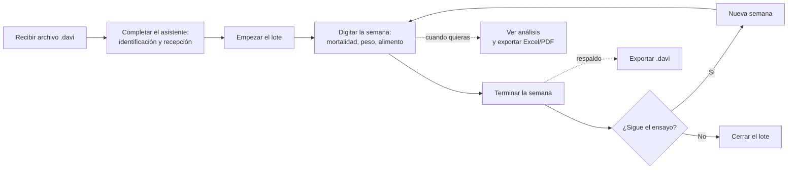
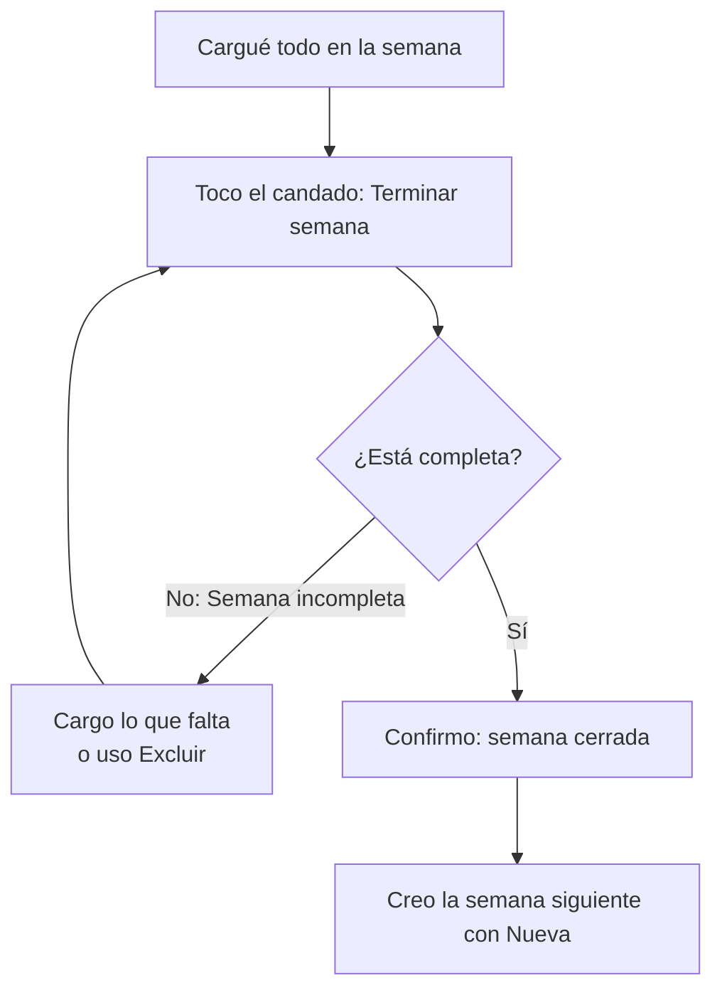

# Manual de usuario — Flock Tracker

Guía para llevar tus ensayos de engorde de pollo desde el teléfono, semana a semana, sin papeles.

---

## Índice

1. [Qué es la app y para qué sirve](#1-qué-es-la-app-y-para-qué-sirve)
2. [Cargar un lote nuevo](#2-cargar-un-lote-nuevo)
3. [La pantalla principal (Gestión diaria)](#3-la-pantalla-principal-gestión-diaria)
4. [Digitar una semana](#4-digitar-una-semana)
5. [Terminar (cerrar) una semana](#5-terminar-cerrar-una-semana)
6. [Ver resultados (Análisis)](#6-ver-resultados-análisis)
7. [Respaldar y compartir el lote](#7-respaldar-y-compartir-el-lote)
8. [PIN y papelera](#8-pin-y-papelera)
9. [Preguntas frecuentes y problemas comunes](#9-preguntas-frecuentes-y-problemas-comunes)

---

## 1. Qué es la app y para qué sirve

Flock Tracker (también llamada DigitadorAvicola) es una app para el teléfono que te ayuda a llevar el control de un **ensayo de engorde de pollo** en una granja experimental.

En vez de anotar todo en planillas de papel y después pasarlo a la computadora, con la app vas cargando directamente en el celular, semana a semana:

- la **mortalidad** (cuántas aves se murieron cada día),
- el **peso** de las aves,
- el **alimento** que entra y el que sobra en cada jaula.

Con eso la app calcula sola los indicadores del ensayo (peso promedio, conversión de alimento, mortalidad) y te deja **sacar reportes en Excel y PDF** para compartirlos por correo o WhatsApp.

### Glosario en criollo

Estos son los términos que vas a ver dentro de la app:

| Palabra | Qué significa |
|---|---|
| **Partida / Lote** | El grupo de pollos que vas a seguir durante todo el ensayo. La **partida** tiene un número de 4 dígitos (por ejemplo 0001) y dentro puede tener uno o varios **lotes** (los grupos de aves que llegaron, cada uno con su edad inicial en semanas). |
| **Galera / Galpón** | El edificio donde están los pollos. Un ensayo puede tener una o varias galeras. |
| **Tratamiento** | Cada una de las "recetas" o condiciones que estás comparando en el ensayo (por ejemplo distintos alimentos o aditivos). En la app aparecen con etiquetas como K1, K2, K3… |
| **Parcela / Jaula / Repetición** | El corralito individual donde está un grupito de aves. Es la unidad más chica que digitás. Cada tratamiento se repite en varias parcelas para que el resultado sea confiable. |
| **Referencia de alimento (BR1, BR2…)** | El tipo de alimento que se está dando. A lo largo del engorde se suele cambiar de alimento (de iniciador a terminador), por eso hay BR1, BR2, BR3 y BR4. Podés tener más de uno activo a la vez cuando estás haciendo el cambio. |
| **Ingreso / Saldo** | Cuando hablamos de alimento: el **ingreso** es lo que se le agregó a la jaula esa semana, y el **saldo** es lo que quedó sin comer al final de la semana. La app usa los dos para calcular cuánto comió realmente el ave. |
| **Semana** | El ensayo se organiza por semanas. Cada semana cargás los datos, la revisás y la "terminás". Después pasás a la siguiente. |

> **Importante desde ya:** los datos de tus lotes viven **solo en este teléfono**. La app no los guarda en internet ni en la nube. Por eso, más adelante te vamos a insistir con que hagas respaldos seguido (ver [sección 7](#7-respaldar-y-compartir-el-lote)).

### El ciclo de trabajo, de un vistazo

---

## 2. Cargar un lote nuevo

Un lote nuevo arranca a partir de un **archivo `.davi`**. Ese archivo lo prepara la persona que diseña el ensayo (normalmente desde la planilla de la computadora) y te lo envía. El archivo trae ya armada la distribución del ensayo: cuántas galeras, cuántos tratamientos y cuántas parcelas hay.

### Paso 1 — Abrir el archivo `.davi`

Tenés dos maneras:

- **Desde WhatsApp, el correo o el explorador de Archivos:** simplemente tocá el archivo `.davi` que te enviaron. El teléfono te ofrecerá abrirlo con Flock Tracker. Aceptá y la app se abre con el lote ya cargado como **pendiente**.
- **Desde la app:** en la pantalla principal, tocá el botón verde **"Cargar archivo"** (abajo a la derecha) y buscá el `.davi` en tu teléfono.

Cuando el archivo entra, aparece una **tarjeta amarilla "Pendiente"** en tu lista de lotes. Esa tarjeta tiene cuatro puntitos arriba que te muestran cuánto te falta para terminar de cargarlo (Archivo → Identificar → Recepción → Empezar).

> Si te avisan que **"Este lote ya está cargado"**, es porque ya tenías ese mismo archivo en el teléfono. Podés cancelar, o elegir **"Guardar como copia"** si de verdad querés una segunda versión (la app le pone una "-C2" al número para distinguirla).

### Paso 2 — Completar el asistente

Tocá la tarjeta pendiente para abrir el asistente. Son **3 pasos** y arriba siempre ves en cuál estás ("Paso X de 3"). Todo se va guardando solo a medida que avanzás, así que si te interrumpen, podés retomar donde dejaste.

**Paso 1: Identificación**

Completá los datos generales del ensayo:

- **Nº de partida:** el número de 4 dígitos.
- **Fecha de ingreso:** el día en que entraron las aves (se elige en un calendario).
- **Lotes:** agregá uno o más lotes de aves. Escribí el nombre del lote y tocá el botón "+". A cada lote ponele su **edad inicial en semanas**, escribiéndola directo en su casilla. La app te muestra la edad promedio.

Más abajo vas a ver un resumen de la **distribución cargada** (galeras, tratamientos y parcelas) que vino en el archivo. Eso es solo para que confirmes que es el ensayo correcto; no se edita acá.

Cuando estén los tres datos básicos completos, el botón **"Siguiente"** se activa.

**Paso 2: Recepción (las aves y su peso al inicio)**

Acá registrás **cuántas aves entraron y cuánto pesaron** en cada parcela. Es el punto de partida del ensayo.

- Las parcelas están organizadas en **pestañas por línea** (arriba). Deslizá entre pestañas para no marearte.
- Por cada parcela cargás dos números: **AVES** (cuántas entraron) y **PESO TOTAL (g)** (el peso de toda la caja, en gramos).
- La app calcula sola el peso promedio por ave y te avisa si algún valor parece raro (queda con borde rojo o amarillo).

Abajo, una franja te dice cuánto te falta ("Te falta digitar X de Y parcelas"). El botón **"Ver Distribución Final"** se activa recién cuando **todas** las parcelas tienen sus dos datos correctos.

**Paso 3: Revisión y empezar**

Es una pantalla de solo lectura para que des un último vistazo: vas pasando por los tratamientos y ves el resumen de aves y pesos cargados.

Cuando esté todo bien, tocá **"Empezar el lote"** y confirmá. A partir de ese momento:

- Se crea la Semana 1 y empieza el seguimiento.
- El lote deja de ser "pendiente" y pasa a ser un **lote activo**.

> **Ojo:** la recepción **no se edita desde el asistente** una vez que empezaste. Si más adelante te das cuenta de que cargaste mal una cantidad de aves o un peso inicial, igual hay forma de corregirlo (ver [sección 9](#9-preguntas-frecuentes-y-problemas-comunes)).

---

## 3. La pantalla principal (Gestión diaria)

Cuando entrás a un lote activo llegás a **Gestión diaria**. Desde acá manejás todo el trabajo de cada semana.

De arriba hacia abajo vas a encontrar:

### El carrusel de semanas

Una fila de **círculos**, uno por semana. Cada círculo:

- muestra el **número de semana**,
- se rellena como una "dona" según **cuánto cargaste** (el porcentaje aparece debajo),
- queda con un **tilde verde** cuando está al 100 %,
- y con un **candado** cuando ya la terminaste.

Tocá un círculo para cambiar de semana. Al final del todo hay un botón **"Nueva"** para crear la semana siguiente (solo se puede si la última ya está terminada).

Debajo del carrusel aparece la **fecha** de la semana que estás viendo.

### El selector de vista: "Por línea" / "Por tratamiento"

Un interruptor para elegir cómo querés ver y cargar las parcelas:

- **Por línea:** las agrupa por la línea física del galpón (A, B, C, D…).
- **Por tratamiento:** las agrupa por tratamiento (K1, K2, K3…).

Elegí la que te resulte más cómoda según cómo recorrés el galpón. Podés cambiar cuando quieras.

### La lista de galpones

Cada galpón aparece como una tarjeta con su barra de avance. Dentro de cada tarjeta tenés tres tipos de dato para cargar, marcados con su color:

- **MORT.** (mortalidad)
- **PESO**
- **ALIM.** (alimento)

Tocá la línea o el tratamiento que querés cargar dentro de la categoría que necesités, y la app te lleva a la pantalla de digitación.

### Abajo del todo

- Un botón con **candado** para **terminar la semana** (ver [sección 5](#5-terminar-cerrar-una-semana)).
- Un botón grande verde **"¿Cómo va la semana?"** que te lleva al **análisis** con todos los indicadores (ver [sección 6](#6-ver-resultados-análisis)).

> Para **salir del lote** y volver a la lista de todos tus lotes, usá la flecha de atrás. La app te pregunta para confirmar.

---

## 4. Digitar una semana

Esta es la pantalla donde realmente cargás los números. Arriba ves el galpón, la semana y unos indicadores rápidos (**Vivas**, **Prom** de peso, **Mort**). Justo debajo hay dos selectores: uno para cambiar entre **MORT. / PESO / ALIM.** y otro para cambiar de **línea o tratamiento**.

> **El guardado es automático.** No hay botón de "Guardar": a medida que escribís, la app va guardando sola. Podés salir con la flecha de atrás con tranquilidad; verás un breve aviso de "Guardando cambios…".

### Mortalidad (por día)

Vas a ver una grilla: cada fila es una parcela y hay **una casilla por cada día** de la semana (con su fecha arriba). Escribí cuántas aves murieron ese día en esa parcela. La columna **TOTAL** suma sola.

> La app no te deja anotar más muertes que aves vivas haya. Si intentás poner un número imposible, simplemente no lo acepta.

### Peso

Cada fila es una parcela. Vas a ver:

- **AVES:** cuántas hay vivas (lo calcula la app),
- **PESO TOTAL (g):** acá escribís el peso, en gramos, de toda la muestra que pesaste,
- **PROM:** la app calcula sola el promedio por ave (g/ave).

### Alimento (ingreso y saldo)

Esta es la más completa. Arriba tenés los botones **"REFS ACTIVAS"** (BR1, BR2, BR3, BR4): marcá cuáles alimentos se están usando esta semana. Por cada referencia activa, cada parcela tiene tres columnas:

- **ANT:** el saldo que quedó la semana pasada (lo trae solo, no se toca).
- **ING:** lo que **ingresó** de alimento esta semana. **Acá escribís vos.**
- **SAL:** el **saldo** que quedó sin comer al final de la semana. **Acá escribís vos.**

> **El alimento se carga en kilogramos (kg)**: el ingreso, el saldo y el ajuste. Hay un ícono de ayuda "!" que te lo recuerda. (El peso de las aves, en cambio, va en gramos.)

También hay una columna **ADJ** (ajuste) por si necesitás corregir el consumo de una parcela puntual.

### Sumar pesadas por grupos

Cuando la balanza no aguanta todas las aves de una jaula de una vez, se pesan por grupos
—de 10 en la semana 2, de 4 en la 3, según vaya creciendo el lote—. Para no ir sumando
aparte:

- Tocá el ícono de calculadora que está a la derecha de la casilla de **PESO TOTAL**.
- Cargá el peso de cada grupo. Se van listando, y podés borrar el que digitaste mal.
- Abajo ves el **total** y el **promedio por ave** mientras cargás. Si el promedio te
  parece raro, es que falta un grupo o se coló un número de más.
- **Usar total** lo lleva a la casilla.

Si volvés a abrir la ventana, están las pesadas que habías cargado.

> Si escribís el total directamente en la casilla, el desglose de grupos se borra: ya no
> sería cierto que esos grupos suman ese total.

### El check "Excluir"

Debajo de cada referencia de alimento (BR1, BR2…) hay un botón chico **"Excluir"**. Sirve para cuando una referencia **no la querés contar** en los indicadores de esa semana (por ejemplo, un alimento de prueba o una carga que no corresponde al análisis).

Qué hace exactamente:

- La referencia **sigue visible y la podés seguir digitando** con normalidad.
- Pero **no se cuenta** en los cálculos (conversión, consumo, etc.).
- Y **no te van a exigir** completarla para poder terminar la semana.

Cuando una referencia está excluida, su nombre aparece tachado y el botón queda en ámbar diciendo "Excluida". Para volver a incluirla, tocá el botón otra vez.

---

## 5. Terminar (cerrar) una semana

Cuando terminaste de cargar todo lo de una semana, conviene **terminarla**. Eso la deja "cerrada": queda como solo lectura y ya no se modifican por accidente sus pesos, alimento ni mortalidad. Además, **recién después de terminar una semana podés crear la siguiente**.

Para terminarla, en Gestión diaria tocá el botón con el **candado** (abajo a la izquierda).

### Por qué a veces dice "Semana incompleta"

Antes de cerrar, la app revisa que la semana esté completa. Si falta algo, te muestra el cartel **"Semana incompleta"** con el detalle, por ejemplo:

- *"X parcelas sin peso"* → te falta cargar el peso en esas parcelas.
- *"X parcelas sin alimento completo"* → en esas parcelas falta cargar el **ingreso** de alguna referencia activa.

### Cómo resolver "Semana incompleta"

Tenés tres caminos, según el caso:

1. **Cargá lo que falta.** Volvé a la parcela señalada y completá el peso o el ingreso de alimento que falta.
2. **Usá "Excluir"** en la referencia de alimento que no corresponde contar. Al excluirla, la app deja de exigir que la completes (ver el check "Excluir" en la [sección 4](#4-digitar-una-semana)).
3. **Asegurate de tener al menos una referencia con su columna de ingreso completa.** La semana se considera completa en alimento cuando cada parcela tiene cargado el ingreso de las referencias que de verdad se usaron.

Cuando esté todo en orden, al tocar el candado la app te pide confirmación ("¿Terminar la semana X?") y la cierra.

### Reabrir una semana ya terminada

¿Te diste cuenta de un error en una semana ya cerrada? Se puede reabrir:

- En el carrusel de semanas, **mantené presionado** el círculo de la semana cerrada (la del candado).
- Si tenés PIN activado, te lo va a pedir (ver [sección 8](#8-pin-y-papelera)).
- La semana se desbloquea y vuelve a ser editable.

### Cerrar el lote completo (fin del ensayo)

Cuando el ensayo termina del todo, podés cerrar el lote entero desde **Ajustes → "Cerrar este lote"**. El lote queda archivado en el historial, lo podés seguir consultando y exportando, pero ya no se edita.

---

## 6. Ver resultados (Análisis)

Desde Gestión diaria, el botón verde **"¿Cómo va la semana?"** te lleva al **Análisis de la semana**. Acá ves los indicadores ya calculados, sin tener que hacer cuentas.

Arriba tenés el **Rendimiento Global** del lote en esa semana:

- **Saldo Aves:** cuántas aves quedan vivas en total.
- **Peso Prom.:** el peso promedio por ave.
- **FCR Sem.:** la conversión de alimento de la semana (cuánto alimento se necesitó por cada kilo de pollo).

Más abajo, por cada galpón, una tabla con los números **por tratamiento**:

- **Cons.Sem** (consumo de la semana),
- **Peso**,
- **FCR** (conversión),
- **Mort%** (porcentaje de mortalidad; si es alto se marca en rojo).

Con las flechas de arriba (◀ ▶) podés moverte entre semanas sin volver atrás.

### Exportar a Excel y PDF

Abajo del análisis hay dos botones: **Excel** y **PDF**.

- **Excel** genera la planilla completa con todos los indicadores por parcela y por semana.
- **PDF** genera el resumen lindo de la semana que estás viendo.

Hay además un interruptor **"Métricas adicionales"**: si lo dejás apagado, el Excel sale igual a la planilla del ensayo. Si lo encendés, se agregan columnas extra (FCR ajustado a distintos pesos), que no están en la planilla original.

### Compartir por correo

Cuando tocás Excel o PDF, la app prepara el archivo y abre el menú para **compartir**. Si elegís el correo, ya van listos con **asunto y mensaje escritos** (con el número de partida y el lote), así que solo agregás el destinatario y enviás. También podés compartir por WhatsApp, Drive, etc.

---

## 7. Respaldar y compartir el lote

Esta sección es **la más importante para no perder tu trabajo.**

> **Recordá:** los datos viven **solo en este teléfono**. No hay copia automática en la nube. Si el teléfono se rompe, se pierde o se reinstala la app sin respaldo, **los datos se van con él**.

La forma de respaldar (y de pasar el lote a otro equipo) es **exportar el lote a un archivo `.davi`**.

### Cómo exportar tu lote

1. Entrá al lote y abrí **Ajustes** (el engranaje, arriba a la derecha en Gestión diaria).
2. Tocá **"Exportar lote"**.
3. La app genera un archivo `.davi` con **todo** el lote (recepción y todas las semanas digitadas) y abre el menú para compartir.
4. Mandátelo a vos mismo por correo o WhatsApp, o guardalo en Drive, para tenerlo a salvo.

Ese mismo archivo sirve para **abrir el lote en otro teléfono**: la otra persona lo recibe y lo abre igual que en la [sección 2](#2-cargar-un-lote-nuevo), y le queda el lote completo tal como estaba.

### Buen hábito recomendado

Exportá un `.davi` **cada vez que termines una semana**. Es rápido y es tu red de seguridad. Si algo le pasa al teléfono, con el último `.davi` recuperás todo.

### Compartir la app con otra persona

En **Configuración → Compartir → "Compartir app (APK)"** podés enviarle a un compañero el instalador de la app (por WhatsApp, Bluetooth, Drive…) para que también la pueda usar en su teléfono.

---

## 8. PIN y papelera

### Proteger con PIN

Podés ponerle un **PIN de 4 dígitos** a las acciones delicadas. Se activa desde la pantalla principal: tocá el **engranaje** (arriba a la izquierda) para entrar a **Configuración → Seguridad**.

- **PIN de bloqueo (interruptor):** al activarlo, la app te pedirá el PIN para **entrar a la papelera** y para **desbloquear (reabrir) una semana terminada**.
- **Cambiar PIN:** una vez activado, podés cambiar el código. Te pide el PIN actual y el nuevo (dos veces, para confirmar).

### La papelera

Cuando borrás un lote, no se elimina al instante: va a la **papelera**, por si te arrepentís.

Para entrar, tocá el ícono de **tacho** (arriba a la derecha en la pantalla principal). Si tenés PIN activado, te lo pedirá.

Dentro de la papelera:

- Cada lote borrado muestra **cuántos días le faltan** para borrarse para siempre.
- **Restaurar** (flecha curva): devuelve el lote a tu lista, intacto.
- **Borrar para siempre** (tacho rojo): lo elimina definitivamente. Esto **no se puede deshacer**.

> **Retención: 15 días.** Los lotes en la papelera se borran solos a los 15 días. Si querés conservar uno, restauralo antes de que se venza el plazo. Los que están por vencer (3 días o menos) se marcan en rojo.

### Cómo borrar un lote

En la pantalla principal, **deslizá la tarjeta del lote hacia la izquierda** y confirmá. El lote se va a la papelera.

---

## 9. Preguntas frecuentes y problemas comunes

**No me deja terminar la semana ("Semana incompleta").**
Falta cargar algún dato. El cartel te dice qué: parcelas sin peso o sin alimento. Completá lo que indica; o, si una referencia de alimento no corresponde contarla, usá el botón **"Excluir"** en esa referencia y volvé a intentar. (Ver [sección 5](#5-terminar-cerrar-una-semana).)

**No me deja crear la semana siguiente.**
Para crear una semana nueva, la última tiene que estar **terminada** (cerrada, con su candado). Terminá la semana actual y después tocá **"Nueva"** en el carrusel.

**No veo una referencia de alimento (BR2, BR3…).**
Las referencias se activan en la pantalla de **Alimento**, con los botones **"REFS ACTIVAS"** de arriba. Marcá la que necesités. Cuando creás una semana nueva, la app ya activa solas las referencias que dejaron saldo la semana anterior.

**Una referencia aparece tachada y dice "Excluida".**
Está marcada para no contar en los indicadores. Sigue visible y digitable, pero no entra en los cálculos. Si la querés volver a incluir, tocá el botón **"Excluir / Excluida"** para desmarcarla. (Ver el check "Excluir" en la [sección 4](#4-digitar-una-semana).)

**Me equivoqué en las aves o el peso inicial de una parcela.**
Desde la pantalla principal, **mantené presionada** la tarjeta del lote activo. Te ofrece **editar la recepción** (aves y peso iniciales). Si tenés PIN, te lo pedirá. Lo ya digitado en las semanas se conserva y los indicadores se recalculan con los nuevos valores.

**¿Tengo que guardar manualmente?**
No. Todo se guarda **solo** mientras digitás. Podés salir con la flecha de atrás sin miedo.

**Cargué un valor raro y la app no lo toma.**
Es a propósito: en mortalidad no podés anotar más muertes que aves vivas, y en la recepción te avisa si las aves o el peso quedan fuera de lo razonable (borde rojo o amarillo). Revisá el número.

**Quiero corregir algo de una semana que ya terminé.**
Reabrí la semana: en el carrusel, **mantené presionado** el círculo de la semana cerrada (la del candado) y, si corresponde, ingresá el PIN. Queda editable de nuevo.

**Borré un lote sin querer.**
Andá a la **papelera** (ícono de tacho en la pantalla principal) y tocá **Restaurar**. Tenés hasta 15 días. (Ver [sección 8](#8-pin-y-papelera).)

**Perdí el teléfono / se rompió / reinstalé la app y no están mis lotes.**
Los datos viven solo en el teléfono. Si tenés un **`.davi` de respaldo** (el que exportaste desde Ajustes), abrilo en el teléfono nuevo y recuperás el lote completo. Si nunca exportaste un respaldo, lamentablemente no hay forma de recuperarlo. **Por eso: exportá un `.davi` cada vez que termines una semana.** (Ver [sección 7](#7-respaldar-y-compartir-el-lote).)

**Me dice "Este lote ya está cargado" al abrir un `.davi`.**
Ese lote ya existe en el teléfono. Si solo querías abrirlo, cancelá. Si de verdad necesitás una segunda copia para trabajarla aparte, elegí **"Guardar como copia"**.

**¿Cómo le paso el ensayo a un compañero?**
Exportá el lote a `.davi` (Ajustes → Exportar lote) y enviáselo. Él lo abre con la app y le queda igual. Si todavía no tiene la app, se la podés mandar desde **Configuración → Compartir app (APK)**.

---

*Flock Tracker — Gestión y Control de Lotes.*
