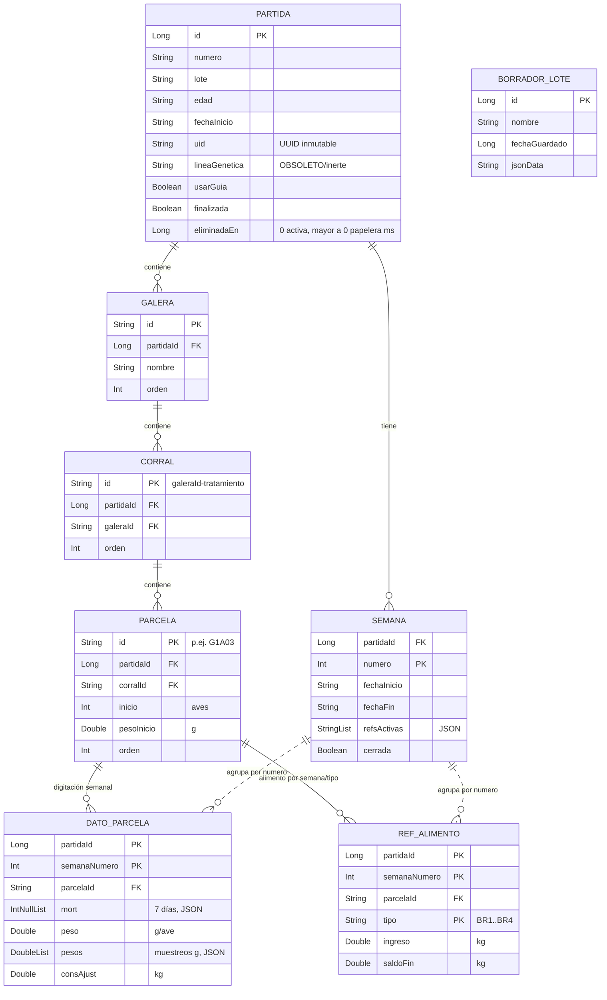

# Modelo de datos — DigitadorAvicola / Flock Tracker

Documentación del modelo de persistencia de la app Android **DigitadorAvicola** (broilers; Kotlin · Room · Hilt). Refleja el estado **actual** del código (BD versión **10**).

Archivos fuente:
- `app/src/main/java/com/digitador/avicola/data/db/entity/Entities.kt`
- `app/src/main/java/com/digitador/avicola/data/db/DigitadorDatabase.kt`
- `app/src/main/java/com/digitador/avicola/data/db/dao/PartidaDao.kt`
- `app/src/main/java/com/digitador/avicola/data/db/dao/SemanaDao.kt`
- `app/src/main/java/com/digitador/avicola/data/repository/DigitadorRepository.kt`
- `app/src/main/java/com/digitador/avicola/data/repository/ConfigRepository.kt`
- `app/src/main/java/com/digitador/avicola/domain/Models.kt`
- Esquemas exportados: `app/schemas/com.digitador.avicola.data.db.DigitadorDatabase/{7,8,9,10}.json`

---

## 1. Jerarquía del dominio

El modelo describe un **ensayo avícola** (engorde de pollos) organizado en una jerarquía de cuatro niveles, más datos semanales:

```
Partida (lote)
└── Galera (galpón)
    └── Corral (= tratamiento)
        └── Parcela (= repetición / jaula)
```

- **Partida** = el lote completo del ensayo (un encasetamiento). Tiene número, lote, edad, fecha de inicio y un `uid` inmutable.
- **Galera** = el galpón físico donde se aloja parte del lote.
- **Corral** = una división dentro de la galera que, en este ensayo, **representa un tratamiento**.
- **Parcela** = la unidad experimental mínima (jaula). Dentro de un corral, cada parcela es una **repetición** del mismo tratamiento.

Transversales a la jerarquía:
- **Semana** (`SemanaEntity`): cada período semanal del lote, con sus fechas, las referencias de alimento activas y su flag de cierre.
- **DatoParcela** (`DatoParcelaEntity`): la digitación de una parcela en una semana concreta (mortalidad diaria, peso, muestreos, consumo ajustado).
- **RefAlimento** (`RefAlimentoEntity`): por parcela/semana/tipo de alimento, el ingreso y el saldo final usados para calcular consumo.

### Convención de IDs de parcela (`G1A03`)

Los IDs de parcela siguen una convención **humana** del tipo `G1A03`:
- `G1` = galera 1 (prefijo `G` + número).
- `A` = línea/fila dentro del corral.
- `03` = número de repetición.

⚠️ **Esta convención NO está validada por el código.** El parser solo usa:
- los dígitos de `galera.id` (para el "bloque"), y
- `corral.id.substringAfterLast("-")` (para el label de tratamiento).

La repetición se deriva del **índice de la parcela dentro del corral** (`orden`), no del texto del ID. Por lo tanto los IDs `G1A03` son convención de legibilidad; la app no los valida.

### Un corral ES un tratamiento

Un corral representa un tratamiento. El **label del tratamiento** se obtiene del ID del corral tomando lo que sigue al `-`:

```
corralId = "$gId-$tLabel"     // p.ej. "G1-K2"  →  tratamiento "K2"
```

Esto se ve al crear partidas pendientes en `DigitadorRepository.crearPartidaPendiente`: por cada galera se genera un corral por tratamiento con `id = "$gId-$tLabel"`, y el nombre de galera se reconstruye como `"Galera " + gId.removePrefix("G")`.

---

## 2. Entidades Room

Todas las entidades viven en `Entities.kt`. Los `Converters` (Gson) están registrados a nivel de base de datos (`@TypeConverters(Converters::class)` en `DigitadorDatabase.kt`) y, redundantemente, en las entidades que usan listas.

> **IDs compuestos por `partidaId`:** Galera, Corral, Parcela, Semana, DatoParcela y RefAlimento usan claves primarias **compuestas** que incluyen `partidaId`. Así, un mismo `id` textual (p.ej. `"G1"`, `"G1-K2"`, `"G1A03"`) puede repetirse entre distintos lotes sin colisionar. Las claves foráneas también son compuestas e incluyen `partidaId`.

### 2.1 `partida` — `PartidaEntity`

`Entities.kt:35-54`

- **Tabla:** `partida`
- **PK:** `id` (`Long`, `autoGenerate = true`)
- **FK:** ninguna (es la raíz).
- **Índices:** ninguno explícito (solo la PK).

| Campo | Tipo | Significado |
|---|---|---|
| `id` | `Long` | PK autogenerada. `0L` = lote nuevo (Room asigna el real al insertar). |
| `numero` | `String` | Número de partida/lote (texto, p.ej. `"3580"` o `"3580-C2"` para copias). |
| `lote` | `String` | Identificación del lote (campo libre). |
| `edad` | `String` | Edad inicial (texto). |
| `fechaInicio` | `String` | Fecha de encasetamiento (texto). |
| `uid` | `String` | **Identificador único e inmutable del lote (UUID).** Permite deduplicar al recargar un backup y generar copias. Se genera al crear la partida. Añadido en BD v8. |
| `lineaGenetica` | `String` | 🚫 **COLUMNA OBSOLETA / INERTE.** La app no usa "línea genética". Se conserva solo para no forzar una migración destructiva. **No se lee ni se escribe** desde el dominio (no aparece en `loadPartida`/`guardarPartida`). |
| `usarGuia` | `Boolean` | Si se usa la guía/curva de referencia para el lote. Default `true`. |
| `finalizada` | `Boolean` | Lote cerrado/terminado. Default `false`. |
| `eliminadaEn` | `Long` | **Soft delete.** `0` = activa; `>0` = timestamp (ms) en que se movió a la papelera. Se purga definitivamente tras 15 días. Añadido en BD v9. |

### 2.2 `galera` — `GaleraEntity`

`Entities.kt:58-69`

- **Tabla:** `galera`
- **PK compuesta:** `["id", "partidaId"]`
- **FK:** `partidaId` → `partida.id`, `onDelete = CASCADE`
- **Índices:** `Index("partidaId")`

| Campo | Tipo | Significado |
|---|---|---|
| `id` | `String` | ID textual de la galera (p.ej. `"G1"`). |
| `partidaId` | `Long` | Lote al que pertenece (parte de PK y FK). |
| `nombre` | `String` | Nombre visible (p.ej. `"Galera 1"`). |
| `orden` | `Int` | Orden de presentación. Default `0`. |

### 2.3 `corral` — `CorralEntity` (= tratamiento)

`Entities.kt:73-86`

- **Tabla:** `corral`
- **PK compuesta:** `["id", "partidaId"]`
- **FK:** `["galeraId", "partidaId"]` → `galera["id", "partidaId"]`, `onDelete = CASCADE`
- **Índices:** `Index("galeraId", "partidaId")`, `Index("partidaId")`

| Campo | Tipo | Significado |
|---|---|---|
| `id` | `String` | ID textual del corral, formato `"$galeraId-$tratamiento"` (p.ej. `"G1-K2"`). El label de tratamiento es la parte tras el `-`. |
| `partidaId` | `Long` | Lote al que pertenece (parte de PK y FK). |
| `galeraId` | `String` | Galera contenedora (parte de FK). |
| `orden` | `Int` | Orden de presentación. Default `0`. |

### 2.4 `parcela` — `ParcelaEntity` (= repetición)

`Entities.kt:90-105`

- **Tabla:** `parcela`
- **PK compuesta:** `["id", "partidaId"]`
- **FK:** `["corralId", "partidaId"]` → `corral["id", "partidaId"]`, `onDelete = CASCADE`
- **Índices:** `Index("corralId", "partidaId")`, `Index("partidaId")`

| Campo | Tipo | Significado |
|---|---|---|
| `id` | `String` | ID textual de la parcela (p.ej. `"G1A03"`). Convención humana, no validada. |
| `partidaId` | `Long` | Lote al que pertenece (parte de PK y FK). |
| `corralId` | `String` | Corral (= tratamiento) contenedor (parte de FK). |
| `inicio` | `Int` | Aves recibidas en la recepción (Paso 2). Default `0`. |
| `pesoInicio` | `Double` | Peso total de recepción, en **gramos**. Default `0.0`. |
| `orden` | `Int` | Orden de presentación; también determina el número de repetición. Default `0`. |

### 2.5 `semana` — `SemanaEntity`

`Entities.kt:109-124`

- **Tabla:** `semana`
- **PK compuesta:** `["partidaId", "numero"]`
- **FK:** `partidaId` → `partida.id`, `onDelete = CASCADE`
- **Índices:** `Index("partidaId")`
- **Converters:** usa `Converters` para `refsActivas` (lista ↔ JSON).

| Campo | Tipo | Significado |
|---|---|---|
| `partidaId` | `Long` | Lote (parte de PK y FK). |
| `numero` | `Int` | Número de semana (parte de PK). |
| `fechaInicio` | `String` | Fecha de inicio de la semana. |
| `fechaFin` | `String` | Fecha de fin de la semana. |
| `refsActivas` | `List<String>` | Tipos de alimento activos esa semana. Serializado a JSON con Gson. Default `["BR1"]`. |
| `cerrada` | `Boolean` | `true` = semana terminada/bloqueada; su digitación queda en **solo lectura**. Default `false`. Añadido en BD v10. |

### 2.6 `dato_parcela` — `DatoParcelaEntity`

`Entities.kt:128-145`

- **Tabla:** `dato_parcela`
- **PK compuesta:** `["partidaId", "semanaNumero", "parcelaId"]`
- **FK:** `["parcelaId", "partidaId"]` → `parcela["id", "partidaId"]`, `onDelete = CASCADE`
- **Índices:** `Index("partidaId")`, `Index("semanaNumero")`, `Index("parcelaId")`
- **Converters:** `mort` (`List<Int?>`) y `pesos` (`List<Double>`) ↔ JSON.

| Campo | Tipo | Significado |
|---|---|---|
| `partidaId` | `Long` | Lote (parte de PK). |
| `semanaNumero` | `Int` | Semana (parte de PK). |
| `parcelaId` | `String` | Parcela (parte de PK y FK). |
| `mort` | `List<Int?>` | Mortalidad por día (7 posiciones, una por día de la semana). `null` = sin dato. Default `List(7) { null }`. |
| `peso` | `Double?` | Peso promedio g/ave de la semana (gramos). `null` = sin dato. |
| `pesos` | `List<Double>` | Muestreos múltiples de peso (gramos). Default `emptyList()`. |
| `consAjust` | `Double?` | Consumo ajustado (en **kg**, ver §8). `null` = sin dato. |

### 2.7 `ref_alimento` — `RefAlimentoEntity`

`Entities.kt:149-164`

- **Tabla:** `ref_alimento`
- **PK compuesta:** `["partidaId", "semanaNumero", "parcelaId", "tipo"]`
- **FK:** `["parcelaId", "partidaId"]` → `parcela["id", "partidaId"]`, `onDelete = CASCADE`
- **Índices:** `Index("partidaId")`, `Index("semanaNumero")`, `Index("parcelaId")`

| Campo | Tipo | Significado |
|---|---|---|
| `partidaId` | `Long` | Lote (parte de PK). |
| `semanaNumero` | `Int` | Semana (parte de PK). |
| `parcelaId` | `String` | Parcela (parte de PK y FK). |
| `tipo` | `String` | Tipo de alimento (`"BR1"`, `"BR2"`, `"BR3"`, `"BR4"`; ver `TIPOS_ALIMENTO`). Parte de PK. |
| `ingreso` | `Double?` | Alimento ingresado, en **kg**. `null` = sin dato. |
| `saldoFin` | `Double?` | Saldo de alimento al final, en **kg**. `null` = sin dato. |

### 2.8 `borrador_lote` — `BorradorLoteEntity`

`Entities.kt:168-174`

- **Tabla:** `borrador_lote`
- **PK:** `id` (`Long`, `autoGenerate = true`)
- **FK:** ninguna. **Independiente** de la jerarquía: guarda un borrador serializado a JSON antes de persistir el lote.

| Campo | Tipo | Significado |
|---|---|---|
| `id` | `Long` | PK autogenerada. |
| `nombre` | `String` | Nombre del borrador. |
| `fechaGuardado` | `Long` | Timestamp de guardado (ms). |
| `jsonData` | `String` | Contenido del borrador serializado (JSON). |

### 2.9 Converters (listas ↔ JSON con Gson)

`Entities.kt:10-31` — clase `Converters`. Cachea una sola instancia de `Gson` y los `Type` (`object : TypeToken<…>(){}`) en un `companion object` para no rehacer reflexión por cada fila leída.

| Conversión | Java ↔ DB |
|---|---|
| `fromStringList` / `toStringList` | `List<String>` ↔ JSON (texto). Usado por `semana.refsActivas`. |
| `fromNullableIntList` / `toNullableIntList` | `List<Int?>` ↔ JSON. Usado por `dato_parcela.mort`. Si la lectura falla devuelve `List(7) { null }`. |
| `fromDoubleList` / `toDoubleList` | `List<Double>` ↔ JSON. Usado por `dato_parcela.pesos`. |
| `fromIntList` / `toIntList` | `List<Int>` ↔ JSON. Disponible (no en uso directo por las entidades actuales). |

Los `to*` devuelven listas vacías (o `List(7){null}`) ante JSON nulo, evitando NPE en lecturas.

---

## 3. DAOs

### 3.1 `PartidaDao` (`PartidaDao.kt`)

Maneja partidas y toda la estructura (galeras/corrales/parcelas) más borradores.

**Partidas — lecturas:**
- `getAllPartidasSync()` — todas, `ORDER BY id DESC`.
- `getActivasSync()` — solo activas (`eliminadaEn = 0`); base del historial.
- `getPapeleraSync()` — solo en papelera (`eliminadaEn > 0`), más reciente primero.
- `getPartidaById(id)` / `getLatestPartida()` — una partida / la última.
- `getExpiradasIds(limite)` — IDs cuya retención ya venció (para la purga).
- `countByUid(uid)` — unicidad de lote (deduplicar al recargar un backup).
- `countByNumeroExcept(numero, excludeId)` — unicidad del número entre lotes **activos**, excluyendo la propia al editar.
- `getAllNumeros()` — números de lotes activos (para generar sufijo de copia).

**Partidas — papelera / soft-delete:**
- `softDelete(id, ts)` — `UPDATE … SET eliminadaEn = ts` (mueve a papelera).
- `restore(id)` — `UPDATE … SET eliminadaEn = 0` (restaura).

**Partidas — escrituras:**
- `insertPartida(p)` (`onConflict = IGNORE`, devuelve rowId o `-1`), `updatePartida(p)`.
- `upsertPartida(p)` — `@Transaction`: inserta; si chocó (`-1L`), hace update y devuelve `p.id`.
- `updateFechaInicio(id, fecha)` — actualización puntual.
- `deletePartidaById(id)` — borrado físico (CASCADE arrastra galeras→corrales→parcelas; semanas/datos/refs se borran aparte en el repo).

**Galeras / Corrales / Parcelas (patrón común):**
- `get…ByPartida(partidaId)` — `ORDER BY orden`.
- `insert…` (`IGNORE`) + `update…` + `upsert…` (`@Transaction`).
- `delete…ByPartida(partidaId)` — borra todas las del lote.
- `delete…NotIn(partidaId, ids)` — borra las que **ya no existen** tras editar (sincroniza estructura). El CASCADE arrastra hijos.

**Parcelas — específicas:**
- `updateParcelaInicio(partidaId, id, inicio, pesoInicio)` — auto-save parcial de la recepción (Paso 2).
- **Agregados** (para summaries rápidos, evitan cargar el estado completo): `sumAvesByPartida(id)`, `sumPesoByPartida(id)`, `countParcelasByPartida(id)`.

**Borradores:**
- `insertBorrador(b)` (`onConflict = REPLACE`), `getBorradores()` (`ORDER BY fechaGuardado DESC`), `deleteBorrador(id)`.

### 3.2 `SemanaDao` (`SemanaDao.kt`)

Maneja semanas, datos de parcela y referencias de alimento.

**Semanas:**
- `getSemanasByPartida(partidaId)` (`ORDER BY numero`), `getSemana(partidaId, n)`.
- `upsertSemana(s)` (`onConflict = REPLACE`).
- `deleteSemana(partidaId, n)`, `deleteSemanasByPartida(partidaId)`.
- `countSemanasByPartida(partidaId)` — conteo barato para summaries.

**Datos de parcela (`dato_parcela`):**
- `getDato(partidaId, sem, pid)`, `getAllDatosByPartida(partidaId)`.
- `upsertDato(d)` (`onConflict = REPLACE`).
- `deleteDatosBySemana(partidaId, sem)`, `deleteAllDatosByPartida(partidaId)`.

**Referencias de alimento (`ref_alimento`):**
- `getAllRefsByPartida(partidaId)`, `getRefs(partidaId, sem, pid)`.
- `upsertRef(r)` (`onConflict = REPLACE`).
- `deleteRefsBySemana(partidaId, sem)`, `deleteAllRefsByPartida(partidaId)`.

---

## 4. `DigitadorRepository`

`DigitadorRepository.kt` — `@Singleton`, inyectado por Hilt con `db`, `partidaDao` y `semanaDao`.

### Rol y estado

Mantiene el **estado de la app activa** en memoria:
- `appState: StateFlow<AppState>` (`asStateFlow` de un `MutableStateFlow`) — observado por las pantallas. `AppState` agrupa `partida`, `semanas` y `datosPorParcela`.
- `currentPartidaId: Long?` (`@Volatile`) — el lote activo al que apuntan las escrituras. Se fija con `setCurrentPartida(id)` o implícitamente al cargar.

### Carga de estado

- `cargarEstado(partidaId)` — fija `currentPartidaId`, carga y **publica** el estado en `_appState`. Si no se pasa id usa `currentPartidaId` o el último lote.
- `loadEstado(id)` (privado) — carga sin mutar `currentPartidaId` ni `_appState`; útil para inspeccionar lotes que no son el activo (resúmenes del historial). Tiene camino rápido: sin semanas no procesa datos/refs.
- `cargarEstadoParaSetup(partidaId)` — carga read-only para el wizard de edición: **no** muta `_appState` (evita recomposiciones en otras pantallas) pero **sí** fija `currentPartidaId` para que los auto-saves apunten al lote correcto.
- `processDatos(...)` / `semMapToRefDomain(...)` — reconstruyen `Map<parcelaId, Map<semana, DatoParcela>>` (con sus refs) desde las entidades planas.

### Operaciones clave

- **`guardarPartida(partida)`** — persiste toda la estructura. Si no hay `uid`, genera/recupera uno inmutable. Toda la escritura (upserts de partida + galeras + corrales + parcelas + borrados de lo que ya no existe) corre dentro de `db.withTransaction { … }` → **atómica**: si algo falla no queda un lote a medio guardar. Sincroniza estructura con `delete…NotIn` / `delete…ByPartida`. Al final fija `currentPartidaId` y recarga estado.
- **`crearPartidaPendiente(distribucion)`** — crea un lote en estado **PENDIENTE**: solo carga la estructura `{galeraId → {tLabel → [parcelaIds]}}` (genera `corralId = "$gId-$tLabel"`); identificación y recepción quedan vacías. También dentro de `db.withTransaction`. Devuelve el id nuevo.
- **Auto-saves del wizard:** `actualizarIdentificacion(...)` (Paso 1: Nº/lote/edad/fecha/usarGuia) y `actualizarRecepcion(...)` (Paso 2: `inicio`/`pesoInicio` por parcela). `actualizarFechaInicioLote(fecha)` puntual.
- **Unicidad y copias:** `existePartidaConUid(uid)`, `existeOtraPartidaConNumero(numero, excludeId)`, `generarNumeroCopia(numeroBase)` (`"3580" → "3580-C2", "-C3"…`).
- **Cierre del lote:** `cerrarPartida()` (marca `finalizada = true`).
- **Semanas:** `upsertSemana(semana)`, `borrarSemana(numero)`, `getSemana(numero)`, `cerrarSemana(numero)` / `reabrirSemana(numero)` (togglean `cerrada`).
- **Datos (auto-save por celda) con patch en memoria:** `saveMortalidad`, `savePeso`, `saveConsAjust`, `saveRefAlimento`. Cada uno persiste la fila vía DAO **y** aplica un parche puntual al `_appState` con `patchDatoEnMemoria(...)` en lugar de recargar todo el lote — mantiene fresco el estado global de forma barata y evita recargas completas por cada pulsación (riesgo de OOM). `upsertSemana` también prefiere el patch en memoria sobre recargar.
- **Resúmenes:** `getPartidaSummaries()` (en paralelo con `async`/`awaitAll`; camino rápido por agregados SQL para pendientes, camino completo con `calcProgreso` para activas), `getPapeleraSummaries()` (con días restantes de purga).
- **Borradores:** `saveBorrador`, `getBorradores`, `deleteBorrador`.

### Papelera y purga

- `moverAPapelera(id)` — soft delete (`softDelete` con `now`); si era la activa, limpia `currentPartidaId`.
- `restaurarDePapelera(id)` — `restore`.
- `borrarFisicamente(id)` — **borrado definitivo** dentro de `db.withTransaction`: borra refs → datos → semanas → la partida (CASCADE limpia la estructura).
- `purgarVencidas(diasRetencion = 15)` — borra físicamente los lotes cuya retención venció (`DIAS_RETENCION = 15`).
- `resetearTodo()` — borra físicamente la partida activa.

> **Regla general:** toda escritura **compuesta** (varias tablas que deben quedar consistentes) corre dentro de `db.withTransaction { … }` para ser **atómica**: `guardarPartida`, `crearPartidaPendiente` y `borrarFisicamente`.

---

## 5. `ConfigRepository` (SharedPreferences `config_app`)

`ConfigRepository.kt` — `@Singleton`. No toca la base de datos; usa `SharedPreferences` con nombre **`"config_app"`** (`MODE_PRIVATE`).

### PIN (hash salado SHA-256)

- El PIN se guarda **solo como hash salado** (SHA-256), nunca en texto plano. `hashPin(p) = SHA-256(salt + p)` en hex.
- **Salt por instalación:** `salt()` genera 16 bytes con `SecureRandom` la primera vez y lo reutiliza (clave `pin_salt`).
- **`verificarPin(p)`** compara contra el hash guardado. **Compatibilidad legacy:** si aún hay un PIN en texto plano (o el default `"0000"`), lo acepta **una vez**, lo migra a hash y borra el plano.
- **`cambiarPin(actual, nuevo)`** valida el actual y exige `nuevo` de **4 dígitos**; guarda solo el hash.
- `setPinHabilitado(activo)` togglea el gate.

### Flags y memoria por lote

- **`pinHabilitado: StateFlow<Boolean>`** — `true` exige PIN para acciones protegidas (papelera, desbloqueo de semana). Default `true`.
- **`modoPorTratamiento: StateFlow<Boolean>`** — modo de digitación: `false` = por línea (A/B/C/D), `true` = por tratamiento (K1, K2…). Default `false`. Set con `setModoPorTratamiento`.
- **Última semana por lote (por `uid`):** `setUltimaSemana(uid, semana)` / `getUltimaSemana(uid)` — recuerda dónde reabrir cada lote (0 si no hay registro).
- **Referencias excluidas (por lote + semana):** `refsExcluidas(uid, sem)` / `setRefExcluida(uid, sem, tipo, excluida)` — `Set<String>` de tipos de alimento excluidos del cálculo de indicadores.

### Claves usadas

| Constante | Clave | Uso |
|---|---|---|
| `KEY_PIN_ON` | `pin_habilitado` | Flag PIN habilitado. |
| `KEY_PIN` | `pin_valor` | **Legacy** (texto plano) → se migra a hash y se elimina. |
| `KEY_PIN_HASH` | `pin_hash` | Hash salado del PIN. |
| `KEY_PIN_SALT` | `pin_salt` | Salt por instalación. |
| `KEY_MODO_TRAT` | `modo_por_tratamiento` | Flag modo por tratamiento. |
| `KEY_ULT_SEM` | `ultima_semana_` + `uid` | Última semana vista por lote. |
| `KEY_REF_EXCL` | `refs_excluidas_` + `uid` + `_` + `sem` | Refs excluidas por lote y semana. |
| `DEFAULT_PIN` | `"0000"` | PIN por defecto (aceptado vía camino legacy). |

---

## 6. Migraciones Room

`DigitadorDatabase.kt` — `@Database(version = 10, exportSchema = true)`, BD física `digitador_avicola.db`.

**Migraciones reales (preservan datos), cada salto solo AÑADE columnas:**

| Migración | Cambio (SQL) |
|---|---|
| `MIGRATION_7_8` | `ALTER TABLE partida ADD COLUMN uid TEXT NOT NULL DEFAULT ''` + asignar un `uid` hex aleatorio (`lower(hex(randomblob(16)))`) a cada lote existente sin uid. |
| `MIGRATION_8_9` | `ALTER TABLE partida ADD COLUMN eliminadaEn INTEGER NOT NULL DEFAULT 0` (soft delete). |
| `MIGRATION_9_10` | `ALTER TABLE semana ADD COLUMN cerrada INTEGER NOT NULL DEFAULT 0` (semana cerrada). |

Detalle: las columnas nuevas **no** declaran `defaultValue` en la entidad, así Room no valida el `DEFAULT` del `ALTER` (necesario para columnas `NOT NULL` en SQLite).

**v10 → v11 (índices):** añade los índices compuestos `(parcelaId, partidaId)` en
`dato_parcela` y `ref_alimento`, y quita los sueltos por `parcelaId` —el compuesto los
cubre como prefijo—. No toca ningún dato. Sin ellos el planificador de SQLite no usaba el
índice de `parcelaId`: caía en el autoíndice de la clave primaria y recorría todas las
filas del lote en cada borrado en cascada de `parcela` (purgar la papelera, reimportar una
distribución distinta). Medido sobre 300 jaulas × 30 semanas, borrar 150 jaulas en
cascada pasó de 127 ms a 19 ms.

**v11 → v12 (suspensión de jaulas):** añade a `parcela` las columnas `suspendida`,
`suspendidaEn` y `suspendidaMotivo`. Solo añade columnas; los lotes existentes quedan
todos activos. Verificada contra SQLite: el juego de columnas resultante coincide con el
que Room declara para la v12 y los datos quedan intactos.

> ⚠️ **Gson y los campos nuevos.** El `.davi` de respaldo deserializa el modelo de dominio
> directamente, y Gson construye los objetos **sin pasar por el constructor de Kotlin**:
> un `String` no-nulo ausente en el JSON queda en `null` y el primer `ifBlank` que lo
> toque lanza NPE. Los archivos anteriores a este cambio no traen esos campos. Por eso
> `ExportService.sanearCamposNuevos()` los normaliza en la frontera del import. **Al
> añadir un campo al dominio hay que ampliarla**, o los respaldos viejos dejan de abrirse.

**Fallback destructivo acotado:** `fallbackToDestructiveMigrationFrom(1, 2, 3, 4, 5, 6)`. Solo recrea la BD (con pérdida) si se viene de versiones **previas** a la exportación de esquema (1..6), improbables en campo. De la **v7 en adelante** los datos se migran; **un salto futuro SIN migración FALLARÁ** en vez de borrar en silencio.

El esquema se exporta a `app/schemas/…/{7,8,9,10,11,12}.json` desde la v7.

> ### 🔧 REGLA al cambiar el esquema
> 1. Modificar la entidad (añadir/quitar columna, índice, etc.).
> 2. **Subir la versión** en `@Database(version = N)`.
> 3. **Escribir la migración** `MIGRATION_(N-1)_N` y registrarla en `addMigrations(...)`.
> 4. Verificar el nuevo `app/schemas/…/N.json` exportado.
>
> Nunca borrar el fallback acotado para "arreglar" un crash de migración: si falta una migración de v7+, **debe** fallar para obligar a escribirla y no perder datos del usuario.

---

## 7. Diagrama entidad-relación



> `BORRADOR_LOTE` se dibuja suelto a propósito: **no tiene FK** hacia la jerarquía (guarda un lote serializado en JSON antes de persistirlo). Las relaciones con líneas punteadas (SEMANA ↔ DATO_PARCELA / REF_ALIMENTO) son lógicas por `numero`/`semanaNumero`, no FKs declaradas (las FKs reales de esas tablas apuntan a `PARCELA`).

---

## 8. Nota de unidades

⚠️ **El alimento y los pesos usan unidades distintas. Es la causa más común de errores 1000×.**

- **Alimento → KILOGRAMOS.** `RefAlimento.ingreso`, `RefAlimento.saldoFin` y `DatoParcela.consAjust` se ingresan y almacenan en **kg**. La `Calculadora` multiplica por `GRAMOS_POR_KG = 1000` para obtener g/ave (`alimKg * 1000 / saldo`). La UI de digitación pide el alimento en kg.
- **Pesos → GRAMOS.** `Parcela.pesoInicio` (peso total de recepción), `DatoParcela.peso` (promedio g/ave) y `DatoParcela.pesos` (muestreos) están en **gramos**.

> Un `.davi` autorizado en gramos para el alimento (como en docs/generadores antiguos) importado en la app actual produce métricas de alimento infladas ×1000. Los `.davi` exportados por la app y los construidos desde la planilla (kg) hacen round-trip correcto.
