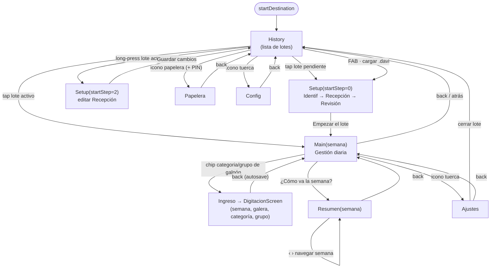

# Pantallas de DigitadorAvicola / Flock Tracker

> Documentación técnica de la capa de UI (Jetpack Compose · Material 3 · MVVM · Navigation type-safe).
> App de seguimiento de lotes de pollos (broilers).
> Referencias de código en formato `archivo:línea` o `archivo · función()`.

---

## 1. Mapa de navegación

### 1.1. El `sealed interface Screen`

Definido en `ui/navigation/NavGraph.kt:20-39`. Es `@Serializable`, por lo que Navigation Compose lo usa como rutas type-safe (cada `data object`/`data class` es un destino con sus argumentos tipados).

| Destino | Tipo | Argumentos | Pantalla que renderiza |
|---|---|---|---|
| `Screen.History` | `data object` | — | `HistoryScreen` |
| `Screen.Setup` | `data class` | `startStep: Int = 0` | `SetupScreen(editMode = true, startStep = …)` |
| `Screen.Papelera` | `data object` | — | `PapeleraScreen` |
| `Screen.Config` | `data object` | — | `ConfigScreen` |
| `Screen.Main` | `data class` | `semana: Int` | `SemanaScreen` (Gestión diaria) |
| `Screen.Ingreso` | `data class` | `semana: Int`, `galera: String`, `categoria: String`, `grupo: String` | **`DigitacionScreen`** |
| `Screen.Resumen` | `data class` | `semana: Int` | `ResumenScreen` |
| `Screen.Ajustes` | `data object` | — | `AjustesScreen` |

**Destino inicial:** `startDestination = Screen.History` (`NavGraph.kt:47`).

Notas clave sobre rutas no obvias:

- **`Screen.Ingreso` → `DigitacionScreen`**: el nombre de la ruta es "Ingreso" pero el composable es `DigitacionScreen` (`NavGraph.kt:126-141`). La `categoria: String` se deserializa a `DigitacionCategory` con fallback a `MORTALIDAD` si el valor es inválido (`NavGraph.kt:128-132`).
- **`Screen.Setup(startStep)` cubre dos casos** (`NavGraph.kt:84-107`):
  - `startStep = 0` → completar un lote **pendiente** (`.davi` cargado); al terminar limpia el stack hasta History y abre `Main(1)`.
  - `startStep = 2` → editar la **Recepción** de un lote **activo**; al terminar hace `popBackStack(History)` (no abre digitación).
  - La distinción se hace con `val editandoActivo = args.startStep > 0` (`NavGraph.kt:89`).
- **Transiciones**: deslizamiento horizontal + fade de 250 ms para todas las navegaciones (`NavGraph.kt:43-51`).
- `Screen.Main.onReset` y `Ajustes.onPartidaCerrada` navegan a `History` con `popUpTo(0){inclusive=true}` (limpian todo el back stack) (`NavGraph.kt:118-122`, `159-164`).
- `Screen.Resumen.onNavSemana` re-navega a `Resumen(n)` con `popUpTo` de la semana actual inclusive: navegar entre semanas en el resumen no apila pantallas (`NavGraph.kt:148-153`).

### 1.2. Diagrama Mermaid

---

## 2. Pantallas

### 2.1. History — `ui/screen/history/`

**Propósito.** Pantalla de inicio: lista de lotes (partidas) con tres estados (pendiente / activo / cerrado), buscador, filtros, acceso a papelera y configuración, y carga manual de archivos `.davi`. Es el hub desde el que se entra a todos los flujos.

**Estado — `HistoryUiState`** (`HistoryViewModel.kt:19-23`):
- `partidas: List<PartidaSummary>` — resúmenes de cada lote.
- `loading: Boolean` (inicial `true`).
- `error: String` — mensaje de error breve (se autolimpia a los 3 s, ver `HistoryScreen.kt:150-155`).

Además el ViewModel expone un flujo aparte: `pinHabilitado: StateFlow<Boolean>` (proveniente de `ConfigRepository`) y el helper `verificarPin(p)` (`HistoryViewModel.kt:36-37`).

**ViewModel — responsabilidades y llamadas al repo** (`HistoryViewModel.kt`):
- `recargar(force)` — debounce de 800 ms para evitar recargas redundantes al reentrar; llama `repo.purgarVencidas()` (purga de papelera con retención de 15 días) y `repo.getPartidaSummaries()` (`:45-58`). Se invoca en `init` (forzado) y en cada `LaunchedEffect(Unit)` al volver a la pantalla (`HistoryScreen.kt:137`).
- `cargarDaviDesdeUri(context, uri, onCreated)` — lee el JSON del `.davi`, lo parsea con `parseDistribucion(...)` (soporta el formato con clave `"galeras"` y el formato plano `Map<galera, Map<trat, parcelas>>`), crea una partida pendiente con `repo.crearPartidaPendiente(dist)` y devuelve el `id` (`:65-85`, `:89-111`).
- `selectPartida(id)` → `repo.setCurrentPartida(id)` (`:113-115`).
- `deletePartida(id)` → `repo.moverAPapelera(id)` (borrado suave, NO físico) + `recargar(force=true)` (`:118-123`).
- `clearError()`.

**Interacciones y flujos clave** (`HistoryScreen.kt`):
- **Hero animado**: cabecera verde (`PrimaryGradient`) con logo (pop por spring), título "Flock Tracker", subtítulo y burbujas ambientales dibujadas en fase de `drawBehind` (no recomponen la pantalla) (`:175-299`). Se pinta detrás de la status bar (`statusBarsPadding`).
- **Buscador** por número/lote y **filtros** "Todos / Pendientes / Activos / Cerrados" (chips `FilterChip` con `weight(1f)`) (`:303-333`). El filtrado es memoizado con `remember(ui.partidas, searchQuery, selectedFilter)` (`:354-367`).
- **Tarjetas de lote** (`PartidaCard`, `:451-453`):
  - `PendingCard` (`:529-629`): amarilla, 4 `ProgressDots` (Archivo · Identif · Recepción · Empezar via `summary.pasosCompletados`), título/subtítulo dinámicos según `hasIdent`/`hasRecep`, y chips KPI (aves/peso/parcelas, en gris si aún no hay dato).
  - `ActiveCard` (`:456-520`): blanca, anillo de progreso circular con la última semana, "N aves vivas", badge de %.
- **Tap en una tarjeta** → `vm.selectPartida(id)`; si es pendiente llama `onCompletePending` (abre `Setup()`), si es activa llama `onSelect` (abre `Main(1)`) (`:427-432`).
- **Long-press en lote activo** (solo `!pendiente && !finalizada`) → setea `editTarget` → `AlertDialog` de confirmación "¿Editar la partida N?" → si `pinHabilitado` muestra `PinDialog`, si no, navega directo a editar recepción (`onEditarActivo` → `Setup(startStep=2)`) (`:80-134`, `:434-437`).
- **Swipe-to-dismiss** (de derecha a izquierda) sobre una tarjeta → háptica + `AlertDialog` "Borrar partida" → `vm.deletePartida` (mueve a papelera) (`:374-440`).
- **Icono papelera** (TopEnd del hero): si `pinHabilitado`, abre `PinDialog` que al validar llama `onOpenPapelera`; si no, abre directo (`:293-298`, `:68-78`).
- **Icono tuerca** (TopStart): `onOpenConfig` (`:285-290`).
- **FAB "Cargar archivo"**: `ActivityResultContracts.GetContent()` con `launch("*/*")` → `vm.cargarDaviDesdeUri` (`:140-147`, `:159-168`).
- **Estado vacío**: `EmptyHistoryState` cuando no hay partidas y `!loading` (`:442-444`, `:696-719`).

---

### 2.2. Setup — `ui/screen/setup/` (asistente "Completar / Editar lote")

**Propósito.** Asistente de 3 pasos para terminar de configurar un lote pendiente o editar la recepción de uno activo: **1) Identificación → 2) Recepción → 3) Revisión**. Persiste cada paso de forma incremental (auto-save) y, al confirmar, crea (o actualiza) la partida y la Semana 1.

**Estado — `SetupUiState`** (`SetupViewModel.kt:24-47`), campos principales:
- Identificación: `numero` (4 dígitos), `lote` (derivado coma-separado), `edad` (derivado), `lotes: List<LoteEntry>` (fuente de verdad en UI: cada lote con su edad), `fechaInicio`, `usarGuia`.
- Estructura: `numGaleras`, `numTratamientos`, `galeras: List<GaleraSetup>`, `poolParcelas: Map<String, ParcelaSetup>`.
- Control de flujo: `partidaId`, `editMode`, `completingPending`, `initialStep` (1·Identif / 2·Recepción / 3·Revisión), `saving`, `error`.
- Distribución: `parcelsPerTratamiento`, `usesManualDistribution`, `pendingDistribution`, `borradores`.

`ParcelaSetup` (`:60-87`) calcula `pesoPromedio = pesoNum / avesNum` y un `estado: EstadoRecepcion` (VACIA / INCOMPLETA / FUERA_DE_RANGO / OK) con rangos de cordura `RANGO_AVES = 1..5000` y `RANGO_PESO_AVE = 20.0..100.0` g/ave.

**ViewModel — responsabilidades** (`SetupViewModel.kt`):
- `cargarParaEdicion()` — carga **read-only** del lote actual con `repo.cargarEstadoParaSetup()`; reconstruye `poolParcelas` y `galeras` desde la BD (preservando ids reales del `.davi`, sin usar `aplicarDistribucion`); calcula `esPendiente`, `pasoInicial` (donde retomar) y mete todo el cómputo en `Dispatchers.Default` para no bloquear el frame de entrada (`:327-412`).
- **Auto-save por paso**:
  - `guardarIdentificacion()` → `repo.actualizarIdentificacion(...)` (`:414-428`).
  - `sincronizarGalerasConPool()` — vuelca `poolParcelas` (editado en el Paso 2) a `galeras` (que lee el Paso 3) (`:435-444`).
  - `guardarRecepcion()` → `repo.actualizarRecepcion(partidaId, data)` con aves/peso por parcela (`:446-456`).
- `guardar(onSuccess)` (`:673-729`): valida 4 dígitos + fecha; verifica **unicidad** del número con `repo.existeOtraPartidaConNumero(numero, partidaId)`; arma el dominio `Partida` y llama `repo.guardarPartida(partida)`; si es lote nuevo o pendiente recién completado, crea la **Semana 1** con `repo.upsertSemana(Semana(numero=1, …, refsActivas=["BR1"]))`.
- Edición de lotes/edades (`addLote`, `removeLote`, `setLoteEdad`, `setLoteNombre`, `applyTo`) que mantienen sincronizados `lotes` con los strings coma-separados `lote`/`edad` (`:627-671`).
- `setNumero` limita a 4 dígitos (`:618-621`).
- También maneja borradores e import/export de distribución JSON (`saveBorrador`, `compartirBorrador`, `descargarBorrador`, `importDistribucionFromJson`, `confirmDistribution`…) — no expuestos en el flujo principal de los 3 pasos actuales.

**Interacciones y flujos** (`SetupScreen.kt`):
- En `editMode` se difiere `vm.cargarParaEdicion()` 220 ms para no competir con la animación de entrada (`:73-82`); hasta que el VM resuelve `partidaId`/`initialStep` se muestra un loader (`stepSyncedFromVm`, `:88-95`, targetState `0`).
- TopAppBar muestra título ("Completar lote" / "Editar lote") y subtítulo "`nombrePaso` • Paso N de 3" (o "Cargando…") (`:97-117`). El botón atrás retrocede de paso o sale (`:118-122`). `LinearProgressIndicator` = `currentStep/3` (`:134-139`). Todo el contenido usa `imePadding()` (`:132`).
- Pasos como `AnimatedContent` con slide direccional (avanzar desde la derecha, retroceder desde la izquierda) (`:147-195`):
  - **Paso 1 · `Step1Identification`** (`:200-287`): Nº de partida + fecha (`DatePicker` UTC), entrada de lotes con edad por lote (KPI edad promedio en semanas), y panel "Distribución cargada" (galeras/tratamientos/parcelas, solo lectura). Botón "Siguiente" habilitado si `numero.length==4 && lote.isNotBlank() && fechaInicio.isNotBlank()`; al pulsar: `guardarIdentificacion()` → `currentStep=2`.
  - **Paso 2 · `Step3GlobalReception`** (`:511-710`): `HorizontalPager` con tabs por **línea** física (A/B/C/D según galera; `beyondViewportPageCount=0`). Cada parcela: punto de estado + badge ID + campos AVES y PESO TOTAL (g) con marca de error visual. Validación global memoizada con `derivedStateOf` (`vacias`/`incompletas`/`fueraRango`); el footer muestra banner contextual y el botón "Ver Distribución Final" se habilita solo con `puedeAvanzar` (todo OK). Al avanzar: `guardarRecepcion()` + `sincronizarGalerasConPool()` → `currentStep=3`.
  - **Paso 3 · `Step4DistributionReview`** (`:726-1002`): revisión por tratamiento (`ScrollableTabRow` + `HorizontalPager`, chips de galera arriba), KPIs por tratamiento (AVES/PESO/PROM, barra de captura) y tiles por parcela con pill g/ave (verde en rango 35–50, ámbar fuera). Botón "Empezar el lote" / "Guardar cambios" → `AlertDialog` de confirmación irreversible → `vm.guardar(onDone)`.

---

### 2.3. Semana — `ui/screen/semana/` ("Gestión diaria")

**Propósito.** Pantalla central de operación de un lote activo: navegación entre semanas (carrusel de "donas"), elección del modo de digitación (por línea / por tratamiento), lista de galpones con accesos a las tres categorías (mortalidad/peso/alimento) por grupo, y cierre/reapertura de semanas.

**Estado — `SemanaUiState`** (`SemanaViewModel.kt:16-23`):
- `appState: AppState` — todo el lote en memoria (partida, semanas, datos por parcela).
- `semanaActual: Int` — semana visible (se mantiene al ir y volver de digitación).
- `loading`, `showResetDialog`, `showDeleteConfirm`, `error`.

Flujos aparte del VM: `modoPorTratamiento: StateFlow<Boolean>` (persistido en `ConfigRepository`) y helpers `pinHabilitado()`, `verificarPin(p)`.

**ViewModel — responsabilidades** (`SemanaViewModel.kt`):
- Suscripción a `repo.appState` para reflejar cambios globales del lote (`init`, `:45-52`).
- `cargarInicial(semanaNumero)` — se ejecuta **una sola vez** (flag `inicializado`); reabre en la última semana usada (`config.getUltimaSemana(uid)`) o la última existente (`:59-72`).
- `cargar(semanaNumero)` — cambio "en caliente": si el lote ya está en memoria, no hay spinner ni recarga de BD; persiste la "última semana usada" y crea la semana si no existe (`repo.upsertSemana`) (`:74-109`).
- `agregarSemana()` — valida que el lote no esté cerrado y que la última semana esté **terminada** (`cerrada`); calcula `refsActivas` de la nueva semana a partir de las refs con saldo (`saldoFin > 0`) (`:111-167`).
- `validarSemana(numero): ValidacionSemana` — usa `Calculadora.validarSemana(...)`, respetando las refs excluidas (`config.refsExcluidas(uid, numero)`) (`:178-184`).
- `cerrarSemana(numero)` → `repo.cerrarSemana` · `reabrirSemana(numero)` → `repo.reabrirSemana` (`:187-194`).
- `semanaCerrada(numero)`, `borrarSemanaActual`, `toggleRef`, `actualizarFechasSemana`.
- `getProgreso` / `getProgresoGalera` vía `Calculadora` (`:247-258`).

**Interacciones y flujos** (`SemanaScreen.kt`):
- **Header** (`:198-238`): botón atrás (que abre el diálogo "Volver al Historial"), título = **solo el número de partida** (`partida.numero.ifBlank{"Producción"}`) + subtítulo fijo "GESTIÓN DIARIA"; icono `DeleteSweep` para borrar la última semana (solo `isLastWeek`); icono tuerca → Ajustes. El `BackHandler` del sistema también abre el diálogo de reset (`:98-100`).
- **Barra/carrusel de semanas — `WeekNavigationBar`** (`:441-570`):
  - `LazyRow` de `WeekDonut` (mini-donas con % de progreso) + botón `AddWeekButton` ("Nueva").
  - **Centrado automático** de la dona activa: un `LaunchedEffect(targetIndex, semanas.size)` la trae al centro del visor con curva `FastOutSlowInEasing` (350 ms); si ya está totalmente visible no mueve nada para no recortar vecinas (`:457-480`).
  - **Fade en los bordes**: gradientes hacia blanco a izquierda/derecha que aparecen solo del lado con contenido oculto (`canScrollBackward`/`canScrollForward`) (`:517-537`).
  - Cada dona refleja estado (activa / completa / cerrada con candado) (`WeekDonut`, `:577-678`); la fecha de la semana va en una pastilla centrada debajo.
  - **Tap** en una dona → `vm.cargar(n)` (cambio en caliente, sin navegar). **Long-press** en una dona cerrada → si `pinHabilitado` pide PIN (`semanaParaDesbloquear` + `PinDialog`), si no, `vm.reabrirSemana(n)` directo (`:296-302`, `:86-96`).
- **Toggle de vista — `VistaToggle`** (`:305-309`, `:833-864`): segmentado "Por línea / Por tratamiento" → `vm.setModoPorTratamiento`. Afecta cómo se agrupan las parcelas (`groups`) en cada galpón.
- **Lista de galpones — `GaleraDigitacionItem`** (`:321-371`, `:718-830`): por cada galera, progreso + tres categorías (MORT./PESO/ALIM.) con chips por grupo.
  - **Por tratamiento**: 3 filas (`CategoryRow`) con chips deslizables (un `scrollState` compartido sincroniza las tres) + chevron/fade indicando "hay más" (`:780-795`, `:870-939`).
  - **Por línea**: 3 columnas lado a lado (`CategoryBox`) (`:796-827`).
  - Tap en un chip → `onOptionClick(categoría, grupo)` → `onIngreso(semana, galera.id, cat, group)` → navega a `Ingreso` (digitación).
- **Footer** (`:373-436`):
  - Botón-ícono candado: si la semana está cerrada, candado ámbar **no clickeable** (solo lectura); si está abierta, al pulsar `vm.validarSemana(semana)` → si `completa` abre confirmación "¿Terminar la semana N?" (→ `vm.cerrarSemana`), si no, abre el aviso "Semana incompleta" detallando `faltanPeso`/`faltanAlimento`.
  - Botón principal "¿Cómo va la semana?" → `onResumen(semana)`.
- **Diálogos**: reset/volver, eliminar semana, terminar semana, validación incompleta, desbloquear semana con PIN (`:116-190`).
- Errores se muestran como **snackbar** animado (slide+fade+scale) (`:240-285`).

---

### 2.4. Digitacion — `ui/screen/digitacion/` (renderizada por `Screen.Ingreso`)

**Propósito.** Matriz de captura diaria de una galera, para una de tres categorías: **mortalidad** (7 días), **peso** (peso total → g/ave) y **alimento** (ingreso/saldo por referencia BR1–BR4 + ajuste). Auto-guarda con debounce y bloquea la edición si la semana o el lote están cerrados.

**Estado — `DigitacionUiState`** (`DigitacionViewModel.kt:20-43`):
- `semana`, `galera`, `parcels: List<Parcela>`, `datos: Map<String, Map<Int, DatoParcela>>`.
- `activeCategory: DigitacionCategory`, `availableGroups: List<String>`, `activeGroup: String`, `porTratamiento`.
- KPIs: `kpiVivas`, `kpiPromedio`, `kpiMortalidad`.
- `refsExcluidas: Set<String>` (refs de alimento desechadas del cálculo, por lote/semana), `partidaUid`.
- **`finalizada: Boolean`** (lote cerrado **o** semana cerrada → solo lectura) y `motivoBloqueo: String` ("lote" / "semana").

**ViewModel — responsabilidades** (`DigitacionViewModel.kt`):
- `cargar(semNum, galeraId, prefGroup)` — resuelve grupos según `config.modoPorTratamiento`, filtra parcelas del grupo, fija `finalizada`/`motivoBloqueo` (`:63-102`).
- `setCategory` / `setGroup` (`:104-114`).
- **Edición con guards** — todos los `update*` retornan temprano si `finalizada`:
  - `updateMort(...)` valida que la mortalidad del día no exceda el saldo disponible (`:244-267`).
  - `updatePeso(...)` convierte peso total → promedio (`total/saldo`) (`:269-278`).
  - `updateRef(...)` (ingreso/saldoFin por referencia) y `updateConsAjust(...)`: escriben lo digitado en esa casilla y nada más. **No hay réplica automática entre parcelas** — se quitó porque rellenaba casillas que nadie había digitado.
  - `toggleRefExcluida(tipo)` persiste en `config.setRefExcluida(uid, sem, tipo, …)` (`:316-323`).
  - `toggleRef(tipo)` (activa/desactiva una referencia de la semana) (`:325-337`).
- **Auto-save**:
  - `scheduleSave()` — debounce de **1500 ms** tras la última edición; red de seguridad si el SO mata el proceso (`:352-359`).
  - `persist(onComplete)` — guardado completo al salir: cancela el autosave pendiente, persiste y recarga el estado global (`:340-348`).
  - `guardarSemanaActual()` — escribe en `Dispatchers.IO` `saveMortalidad`/`savePeso`/`saveRefAlimento`/`saveConsAjust` sin recargar todo el lote (`:363-377`).
- KPIs recalculados con debounce de 300 ms (`scheduleKpis` / `recalcKpis`) (`:205-242`).

**Interacciones y flujos** (`DigitacionScreen.kt`):
- Al entrar: `vm.cargar(...)` + `vm.setCategory(initialCategory)` (`:64-67`).
- **Header** (`DigitacionHeader`, `:168-305`): app bar verde con nombre de galera + "SEMANA N · MONITOREO DIARIO"; segmentado de categorías (Mort/Peso/Alim, ícono que se expande al seleccionar); segmentado de grupos (líneas o "K1/K7…" según `porTratamiento`); fila de KPIs (Vivas / Prom g / Mort).
- **Banner de bloqueo**: si `ui.finalizada`, fila ámbar con candado y texto distinto según `motivoBloqueo` ("Semana terminada…" / "Lote cerrado…") (`:111-131`).
- **`imePadding()`** en el contenedor: como la app es edge-to-edge, al abrir el teclado se reduce la `LazyColumn` y la fila enfocada sube por encima del teclado (bring-into-view) (`:108-110`).
- Tres matrices según categoría (`:132-138`):
  - **`MortalidadMatrix`** (`:328-432`): cabecera de 7 días (mes/día calculados desde `fechaInicio`), filas con badge de parcela + 7 celdas (`BasicTextField`, máx. 3 dígitos) + total. Las celdas son `readOnly`/`enabled` según `bloqueada` (= `ui.finalizada`).
  - **`PesoMatrix`** (`:434-519`): por parcela muestra aves vivas (saldo), campo de PESO TOTAL (g) y el promedio g/ave derivado.
  - **Calculadora de pesadas.** La celda de PESO TOTAL lleva un ícono `Calculate` a la
    derecha (verde si ya hay desglose guardado) que abre una ventana para sumar el peso de
    cada grupo. Las aves se pesan por grupos —la balanza no aguanta la jaula entera— pero
    se pesan TODAS, así que la suma es el total y el promedio sale de dividirla entre las
    aves vivas, igual que al escribir el total a mano. La ventana muestra el promedio
    mientras se digita, que es lo que delata un dedo de más. El desglose se guarda en
    `DatoParcela.pesos` (campo que ya existía sin usar) y viaja en el `.davi`. **Escribir
    el total a mano borra el desglose**: dejaría en el archivo una descomposición que no
    suma ese número.
  - **Jaulas suspendidas.** Cada fila lleva en su distintivo un ícono `Block` chico,
    superpuesto en la esquina: tenue cuando la jaula está activa (pista de que ahí se
    suspende) y sólido cuando lo está. Tocar o mantener pulsado el distintivo abre el
    diálogo; suspender y reactivar piden PIN. La fila suspendida va con fondo y borde
    rojos y el identificador tachado, y tocarla muestra un Snackbar breve — el gesto se
    observa **sin consumirlo**, así que el campo recibe el foco y se sigue digitando.
  - **`AlimentoMatrix`** (`:521-633`): selector de refs activas (chips BR1–BR4), y por cada ref las columnas ANT (read-only) / ING / SAL, más una columna ADJ (ajuste). El alimento se digita en **kg** (tooltip `UnidadGramosTip`). El **pill "Excluir/Excluida"** por referencia (`Surface` redondeado, ámbar relleno cuando está excluida, texto tachado en el header) → `vm.toggleRefExcluida(ref)` (`:580-608`). Celdas con `AlimentoCellMinimal` (selecciona todo al enfocar para reemplazar).
- **Salida**: `BackHandler` y botón atrás del header muestran un overlay "Guardando cambios…" mientras `vm.persist { onBack() }` (`:73-80`, `:92-104`, `:142-163`).

---

### 2.5. Resumen — `ui/screen/resumen/` ("Análisis de la semana")

**Propósito.** Indicadores calculados de la semana: KPIs globales del lote, una tabla por galera/tratamiento (consumo, peso, FCR, mortalidad %), y exportación a Excel y PDF con mensaje de correo pre-armado.

**Estado — `ResumenUiState`** (`ResumenViewModel.kt:16-20`): `appState`, `semanaActual`, `loading`.

**ViewModel — responsabilidades** (`ResumenViewModel.kt`):
- `cargar(semNum)` → `repo.cargarEstado()` con manejo de excepción para no colgar el spinner (`:38-49`).
- `getMetricasCorral(galera, corral, semNum)` → `Calculadora.computeMetricasCorral(...)`, pasando `refsExcluidasPorSemana(semNum)` (mapa semana→refs excluidas, leído de `ConfigRepository`) (`:51-62`, `:33-36`).
- Expone `repo` y `exportService` (públicos) para que la pantalla dispare las exportaciones.

**Interacciones y flujos** (`ResumenScreen.kt`):
- TopAppBar "Análisis de la semana" / "Semana NN" con flechas ‹ › que navegan a la semana anterior/siguiente (`onNavSemana`, deshabilitadas en los extremos) (`:66-78`).
- **`GlobalKpiCard`** (`:231-274`): "Rendimiento Global" → Saldo Aves, Peso Prom., FCR Sem. (promedios ponderados por saldo, vía `Calculadora.computeMetricasCorral`).
- **Tabla por galera** (`AppPanel` por galera): cabecera Trat./Cons.Sem/Peso/FCR/Mort% y una fila `CorralAnalysisRow` por corral (FCR acumulado, mortalidad % en rojo si > 5%) (`:104-128`, `:284-340`).
- **Switch "Métricas adicionales"** (`incluirExtras`, default OFF): FEP, FCR ajustado a 2.0/2.5/2.7 kg y CV% (no presentes en la planilla del ensayo). Por defecto OFF para que el Excel coincida 1:1 con la planilla (`:48-50`, `:136-156`).
- **Exportar Excel** (`Button`): `vm.exportService.exportarExcel(context, opts)` + `shareFile(...)` con **asunto** "Estadística avícola — Partida N · Lote …" y **mensaje** de correo describiendo el contenido, firmado "— Enviado desde Flock Tracker" (`:158-190`).
- **Exportar PDF** (`OutlinedButton`): `vm.exportService.exportarPdfResumen(context, semanaNumero, opts)` + `shareFile(...)` con asunto/mensaje análogos para la semana (`:191-222`). Ambos botones muestran "Generando…" mientras corren (`exporting`/`exportingPdf`).

---

### 2.6. Ajustes — `ui/screen/ajustes/`

**Propósito.** Acciones a nivel de lote actual: ver su info, exportar el lote como `.davi` y cerrar (finalizar) el lote.

**Estado — `AjustesUiState`** (`AjustesViewModel.kt:17-24`): `partida`, `semanas`, `loading`, `mensaje`, `mensajeEsError`, `procesando`.

**ViewModel — responsabilidades** (`AjustesViewModel.kt`):
- `cargar()` → `repo.cargarEstado()` (partida + semanas) (`:35-46`).
- `cerrarPartida(onDone)` → `repo.cerrarPartida()` + mensaje + callback (que en NavGraph vuelve a History limpiando el stack) (`:48-54`).
- `exportarLote(context)` → `exportService.exportarLote(context)` + `shareFile(...)`; al abrir ese `.davi` en otro equipo la app restaura el lote completo (`:61-74`).

**Interacciones** (`AjustesScreen.kt`):
- Panel "Lote actual" (solo lectura): partida, lote, fecha de inicio, y `AlertBanner` "Este lote está cerrado." si `finalizada` (`:97-129`).
- `ActionTile` "Exportar lote" (deshabilitado mientras `procesando`) → `vm.exportarLote(context)` (`:132-138`).
- `ActionTile` "Cerrar este lote" (solo si `finalizada == false`, estilo `danger`) → `AlertDialog` de confirmación → `vm.cerrarPartida(onPartidaCerrada)` (`:48-63`, `:141-149`).
- Mensajes vía snackbar (`:41-46`).

---

### 2.7. Config — `ui/screen/config/`

**Propósito.** Configuración global de la app: PIN de bloqueo (on/off + cambiar), compartir el APK, y un bloque "Próximamente".

**Estado/ViewModel — `ConfigViewModel`** (`ConfigViewModel.kt`): expone `pinHabilitado: StateFlow<Boolean>` y `setPinHabilitado(activo)`, `cambiarPin(actual, nuevo): Boolean` (todos delegados a `ConfigRepository`), más `exportService` para compartir el APK. No tiene un `UiState` propio.

**Interacciones** (`ConfigScreen.kt`):
- **Seguridad** (`:59-100`):
  - Fila "PIN de bloqueo" con `Switch` → `vm.setPinHabilitado(it)`. El subtítulo aclara que el PIN se exige para la papelera y para desbloquear semanas.
  - Fila "Cambiar PIN" (clickeable solo si `pinOn`) → `CambiarPinDialog` que pide PIN actual + nuevo + confirmación; valida 4 dígitos, coincidencia y PIN actual correcto vía `onConfirm` → `vm.cambiarPin(...)` (que retorna `Boolean`) (`:159-227`).
- **Compartir** (`:102-139`): fila "Compartir app (APK)" → `vm.exportService.compartirApk(context)` + `shareFile(...)`; muestra spinner mientras `compartiendo`.
- **Próximamente** (`:141-155`): tarjeta informativa "Más opciones de configuración en próximas actualizaciones".

---

### 2.8. Papelera — `ui/screen/papelera/`

**Propósito.** Lotes borrados (borrado suave) con retención de **15 días**; permite restaurarlos o borrarlos definitivamente.

**Estado — `PapeleraUiState`** (`PapeleraViewModel.kt:14-17`): `items: List<PapeleraItem>`, `loading`.

**ViewModel — responsabilidades** (`PapeleraViewModel.kt`):
- `cargar()` → `repo.purgarVencidas()` (purga lo vencido) + `repo.getPapeleraSummaries()` (`:27-40`).
- `restaurar(id)` → `repo.restaurarDePapelera(id)` + recarga (`:42-47`).
- `borrarDefinitivo(id)` → `repo.borrarFisicamente(id)` + recarga (`:49-54`).

**Interacciones** (`PapeleraScreen.kt`):
- Banner de retención fijo: "Los lotes eliminados se borran definitivamente a los 15 días…" (`:72-86`).
- Lista de `PapeleraCard`: nombre ("Partida N" / "Lote sin identificar") + "Se borra en N días" (en rojo si `diasRestantes <= 3`), con botón **Restaurar** (`RestoreFromTrash`) y botón **Borrar definitivo** (`DeleteForever`) (`:102-168`).
- Borrar definitivo abre un `AlertDialog` de confirmación ("Esta acción no se puede deshacer") → `vm.borrarDefinitivo(item.id)` (`:38-54`).
- Estado vacío: "La papelera está vacía" (`:92-101`).

---

## 3. Patrones de UI relevantes

- **MVVM + StateFlow + `collectAsState`.** Cada pantalla obtiene su VM con `hiltViewModel()` (Hilt, `@HiltViewModel`) y observa un `MutableStateFlow<XxxUiState>` expuesto como `asStateFlow()` (p. ej. `HistoryViewModel.kt:32-33`, `DigitacionViewModel.kt:52-53`). En la UI: `val ui by vm.ui.collectAsState()`. Config/preferencias se exponen como `StateFlow` separados (`pinHabilitado`, `modoPorTratamiento`).
- **Navigation type-safe.** Rutas modeladas con un `@Serializable sealed interface Screen`; los argumentos se leen con `back.toRoute<Screen.X>()` (`NavGraph.kt`). Las navegaciones usan `popUpTo`/`launchSingleTop` para controlar el back stack (limpieza total con `popUpTo(0){inclusive=true}`).
- **PIN sin exponer el valor en claro.** `PinDialog` (`components/PinPad.kt:29-142`) recibe `onVerify: (String) -> Boolean` y solo notifica `onSuccess()`; la verificación se hace contra el hash del repositorio (`config.verificarPin`). El PIN ingresado nunca sale del diálogo. Se reutiliza en History (papelera, editar recepción) y Semana (desbloquear semana). Mismo patrón en `CambiarPinDialog`, que devuelve `Boolean`.
- **`imePadding()` en digitación y setup.** Al ser edge-to-edge, el teclado no encoge el contenido automáticamente; `imePadding()` reduce el contenedor para que la fila enfocada de la matriz suba por encima del teclado (`DigitacionScreen.kt:110`, `SetupScreen.kt:132`).
- **Auto-save con debounce.** Digitación: `scheduleSave()` a 1500 ms + `persist()` al salir (`DigitacionViewModel.kt:352-359`, `:340-348`). KPIs y réplica de ingreso también con debounce (300/700 ms). Setup persiste por paso (`guardarIdentificacion`/`guardarRecepcion`). History debounce de recarga de 800 ms.
- **Bloqueo de solo-lectura unificado.** El flag `finalizada` (= lote cerrado **o** semana cerrada) propaga `readOnly`/`enabled = !bloqueada` a todos los campos de la matriz, y los `update*`/`persist` retornan temprano (`DigitacionViewModel.kt`). El banner explica el motivo (`motivoBloqueo`).
- **Carrusel centrado + fade.** `WeekNavigationBar` centra la semana activa con `animateScrollBy`/`animateScrollToItem` (ease-in-out) y aplica gradientes a blanco en los bordes según `canScrollBackward/Forward` (`SemanaScreen.kt:457-537`). Patrón análogo de fade+chevron en las filas de tratamiento (`CategoryRow`).
- **Pill de "Excluir" referencia.** En alimento, cada referencia tiene un toggle redondeado que la **desecha del cálculo** sin ocultarla ni impedir digitarla; persiste por lote+semana en `ConfigRepository` y se respeta tanto en la validación de cierre como en el Resumen (`DigitacionScreen.kt:580-608`, `DigitacionViewModel.kt:316-323`).
- **Header de "Gestión diaria" minimalista.** El TopAppBar de Semana muestra **solo el número de partida** + el rótulo fijo "GESTIÓN DIARIA" (sin lote ni fechas) (`SemanaScreen.kt:215-228`).
- **`drawBehind` para animación barata.** El hero de History dibuja burbujas leyendo el valor animado en fase de dibujo (no recompone la pantalla) (`HistoryScreen.kt:233-243`).
- **Componentes compartidos** (`components/Components.kt`): `ProgressBar`, `StatusDot`, `FilterChip`, `AppPanel`, `AlertBanner` (+`AlertType`), `SectionLabel`, usados de forma transversal (filtros de History, paneles de Setup/Resumen, banners de Ajustes/Setup).
- **Mensajería al usuario.** Snackbars animados (Semana, Ajustes), banners inline (Setup, Digitación), y diálogos `AlertDialog` para todas las acciones destructivas/irreversibles (borrar, cerrar lote, terminar semana, empezar lote).
